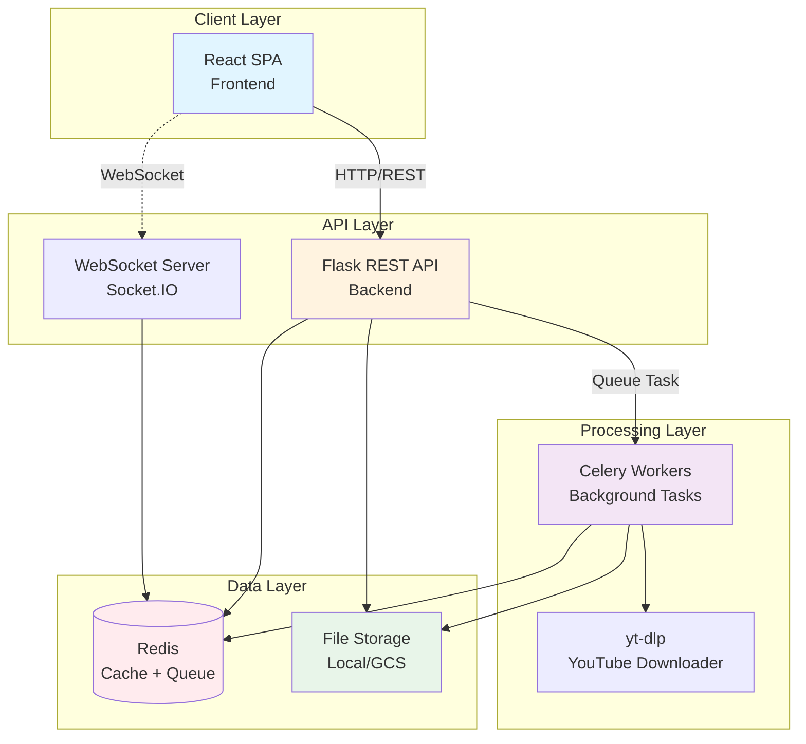
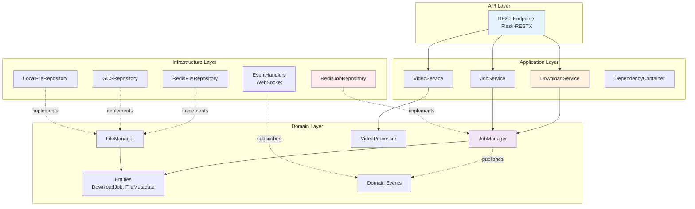
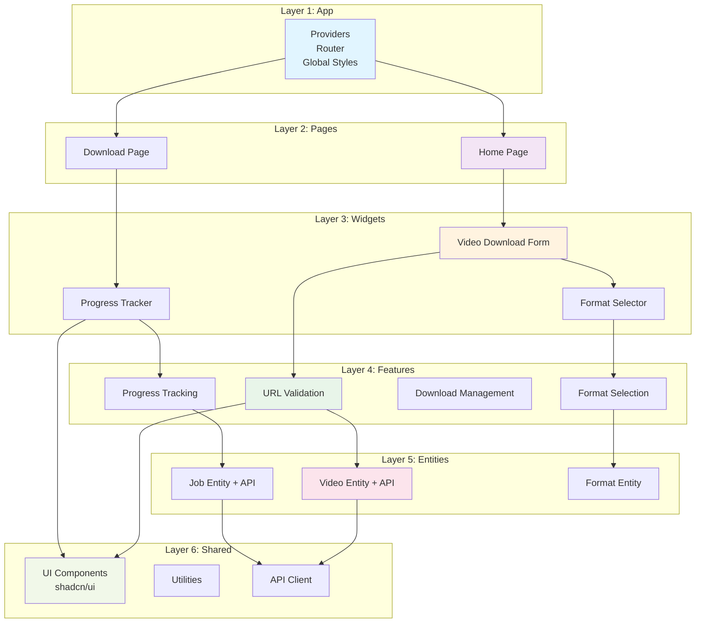
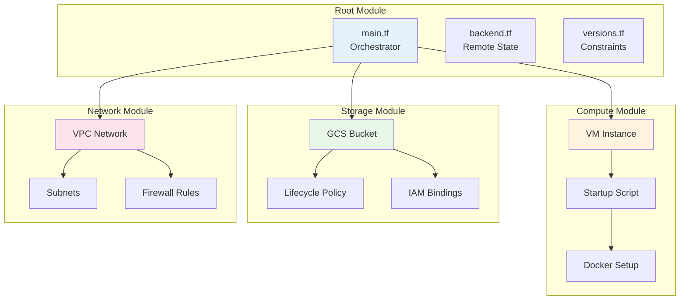
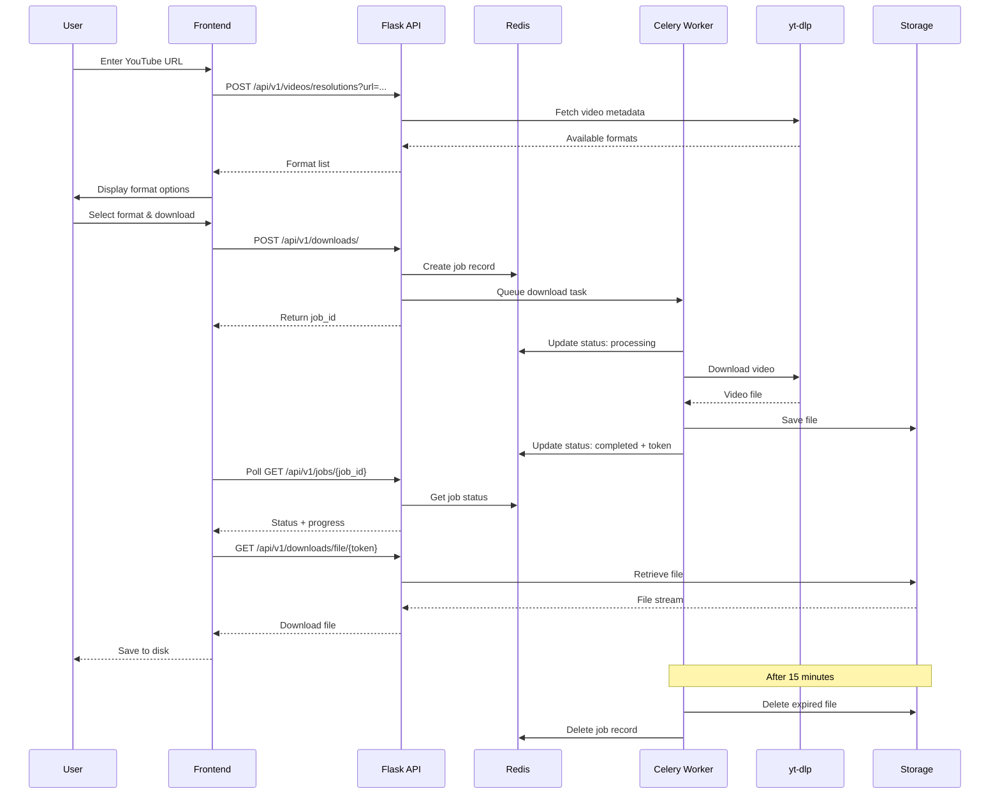
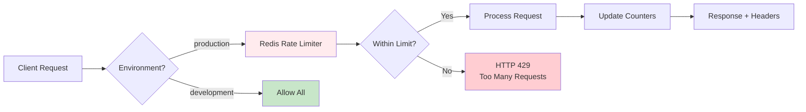
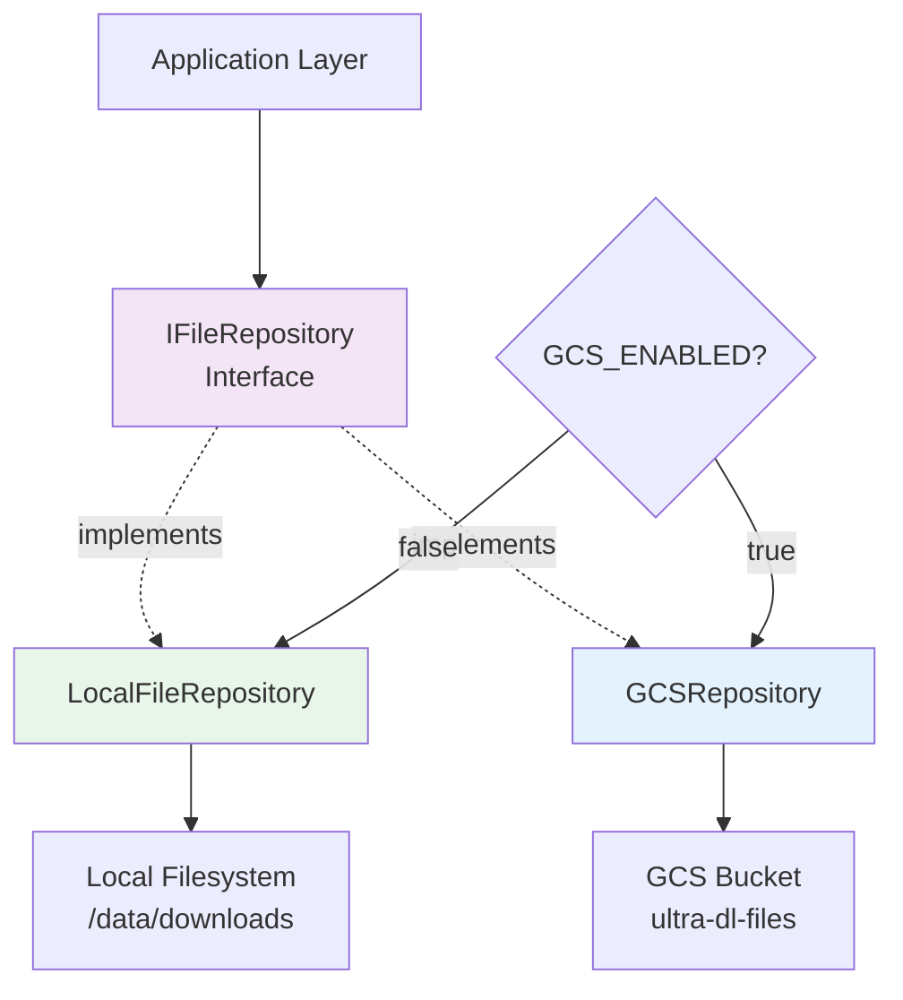

# UltraDL - System Architecture

> **Purpose**: High-level architecture overview showing how all services work together. For service-specific details, see local ARCHITECTURE.md files in each folder.

---

## 🏗️ System Overview

---

## 📐 Architecture Patterns

### Backend: Domain-Driven Design (DDD)

**3-Layer Clean Architecture:**

**Dependency Rule**: Dependencies point inward (Infrastructure → Domain). Domain has zero external dependencies.

**See**: [backend/ARCHITECTURE.md](./backend/ARCHITECTURE.md) for detailed DDD implementation

---

### Frontend: Feature-Sliced Design (FSD)

**6-Layer Vertical Architecture:**

**Import Rule**: Lower layers can only be imported by higher layers. No upward imports.

**Status**: Migration in progress (currently component-based)

**See**: [frontend/ARCHITECTURE.md](./frontend/ARCHITECTURE.md) for FSD migration details

---

### Infrastructure: Terraform Modules

**Module Composition Pattern:**

**See**: [iac/ARCHITECTURE.md](./iac/ARCHITECTURE.md) for Terraform implementation

---

## 🔄 Data Flow

### Download Request Flow

---

## 🔒 Security Architecture

### Rate Limiting (Production Only)

**Limits (per Client IP/Day)**:
- 20 video-without-audio requests
- 20 audio-only requests
- 20 video+audio requests
- 60 total jobs

**Implementation**: Redis-based distributed rate limiting with midnight UTC reset

---

## 🗄️ Data Storage Strategy

### Development vs Production

| Aspect | Development | Production |
|--------|-------------|------------|
| **File Storage** | Local filesystem (`/data/downloads`) | Google Cloud Storage |
| **Job State** | Redis (ephemeral) | Redis (persistent) |
| **Rate Limiting** | Disabled | Enabled (Redis-based) |
| **WebSocket** | Optional | Optional |
| **File Retention** | 15 minutes | 15 minutes |

### Storage Abstraction

---

## 📊 Service Dependencies

### Backend Dependencies
- **Flask** 3.1.2 - REST API framework
- **Celery** 5.5.3 - Background task queue
- **Redis** 7.0.1 - Cache + message broker
- **yt-dlp** - YouTube video downloader
- **Flask-SocketIO** 5.4.2 - WebSocket support (optional)
- **Flask-RESTX** 1.3.0 - Swagger/OpenAPI docs

### Frontend Dependencies
- **React** 18.3.1 - UI framework
- **TypeScript** 5.9.3 - Type safety
- **Vite** 5.4.21 - Build tool
- **TanStack Query** 5.90.7 - Server state management
- **shadcn/ui** - Component library
- **Tailwind CSS** 3.4.17 - Utility-first CSS

### Infrastructure
- **Docker** + Docker Compose - Local development
- **Terraform** - Infrastructure as Code
- **GCP Compute Engine** - Production VM
- **GCP Cloud Storage** - File storage
- **Nginx** - Reverse proxy

---

## 🔗 Related Documentation

- **[Backend Architecture](./backend/ARCHITECTURE.md)** - DDD implementation details
- **[Frontend Architecture](./frontend/ARCHITECTURE.md)** - FSD migration guide
- **[IaC Architecture](./iac/ARCHITECTURE.md)** - Terraform module structure
- **[README.md](./README.md)** - Project overview and quick start
