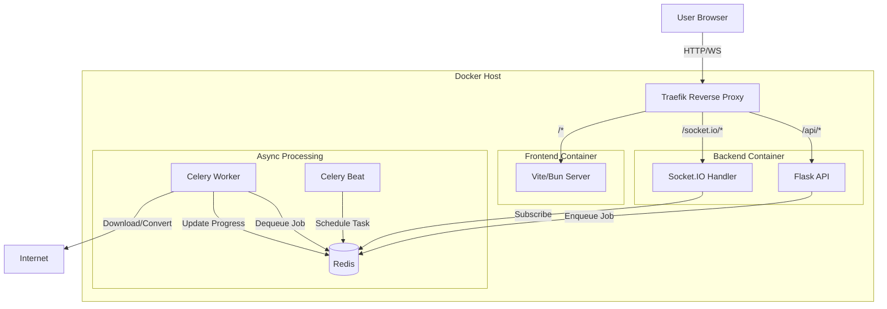

# Architecture Documentation

## High-Level Overview

UltraDL is designed as a distributed system to handle resource-intensive video processing tasks asynchronously.

## Components

### 1. Frontend (`/frontend`)
The frontend is built with **React** and bundled with **Vite** (using **Bun** as the runtime/package manager). It follows the **Feature-Sliced Design (FSD)** methodology.

*   **Structure**:
    *   `app/`: Global providers, styles, and routing configuration.
    *   `pages/`: Route components (composition of widgets/features).
    *   `widgets/`: Compositional units (e.g., Header, ProcessingStatus).
    *   `features/`: User scenarios (e.g., DownloadForm, FormatSelector).
    *   `entities/`: Business domain objects (e.g., Video, Task).
    *   `shared/`: Reusable UI kit, utilities, and API clients.

*   **Key Libraries**:
    *   `@tanstack/react-query`: Server state management.
    *   `socket.io-client`: Real-time updates.
    *   `zod` + `react-hook-form`: Form validation.

### 2. Backend (`/backend`)
The backend is a **Flask** application that exposes a REST API and a WebSocket interface.

*   **API**: RESTful endpoints for initiating downloads, validating URLs, and checking system status.
*   **Asynchronous Processing**:
    *   Long-running tasks (downloads, conversions) are offloaded to **Celery** workers.
    *   This ensures the API remains responsive.
*   **Real-time Communication**:
    *   **Flask-SocketIO** is used to push progress updates to the frontend.
    *   Redis is used as the message broker for socket events.
*   **Core Logic**: Wraps `yt-dlp` for actual media interaction.

### 3. Infrastructure
*   **Redis**: Acts as:
    *   Message broker for Celery.
    *   Result backend for Celery.
    *   Message queue for Socket.IO process synchronization.
    *   Cache for rate limiting and temporary data.
*   **Traefik**:
    *   Reverse proxy handling routing between frontend and backend.
    *   Handles path rewriting and load balancing (if scaled).

## Data Flow (Download Request)

1.  **Request**: User submits a URL via the Frontend.
2.  **API Call**: Frontend sends POST request to `/api/v1/jobs`.
3.  **Queueing**: Backend validates request and pushes a job to Redis (via Celery). Returns a `job_id` immediately.
4.  **Processing**: Celery Worker picks up the job, invokes `yt-dlp` to download/convert.
5.  **Progress**: Worker updates progress in Redis and emits Socket.IO events.
6.  **Completion**: File is saved to a shared volume. Frontend receives 'completed' event and triggers a file download from the served volume.
