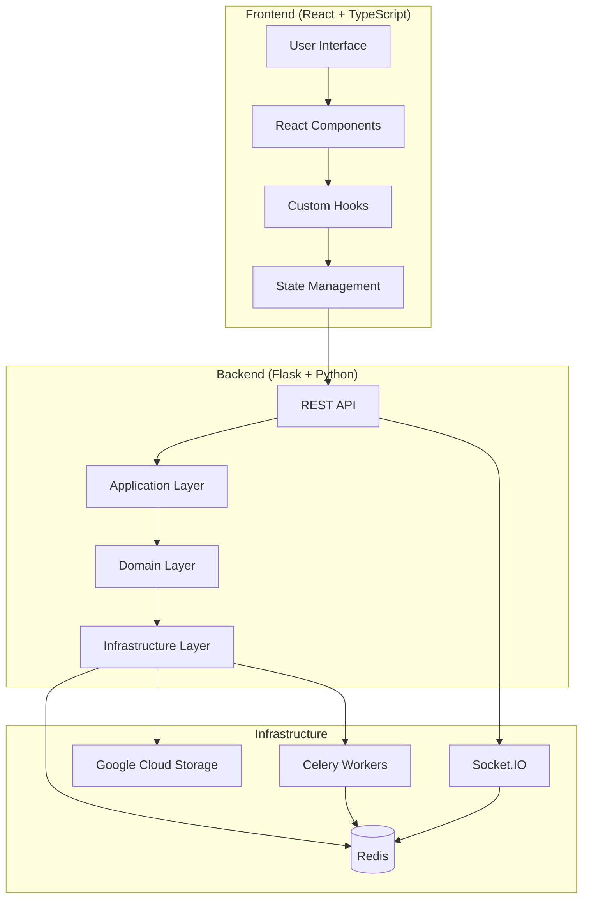
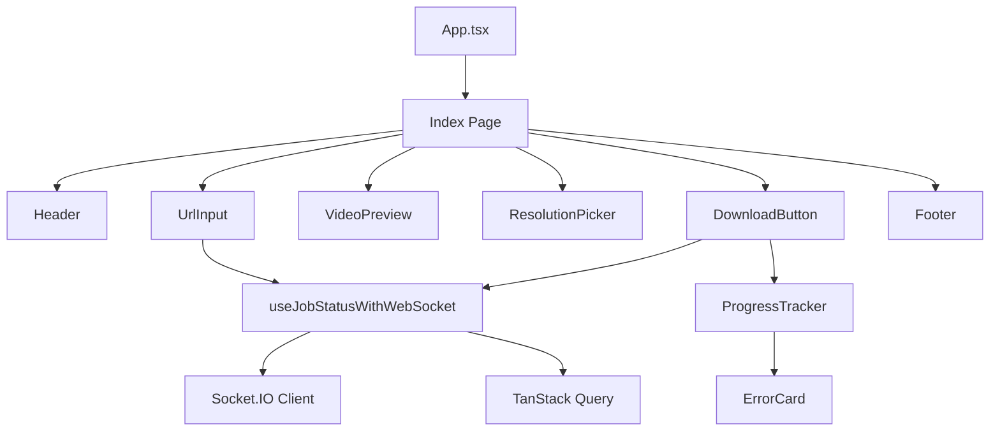
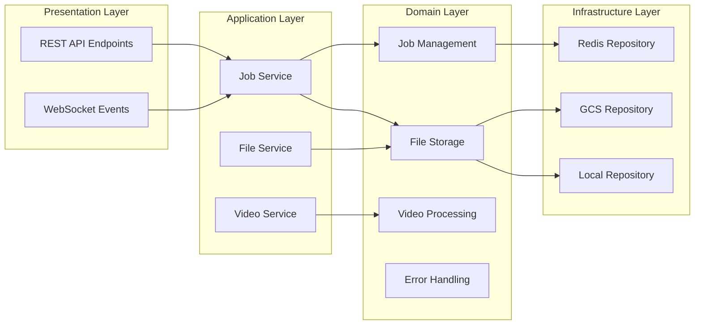
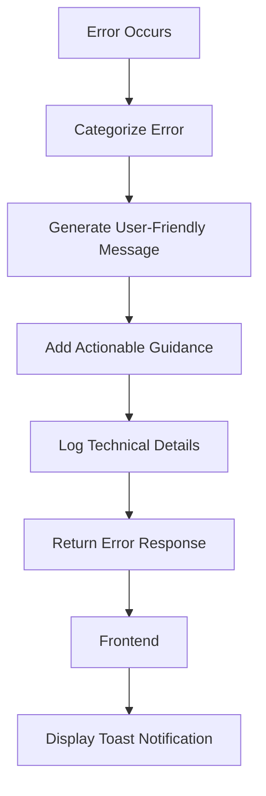
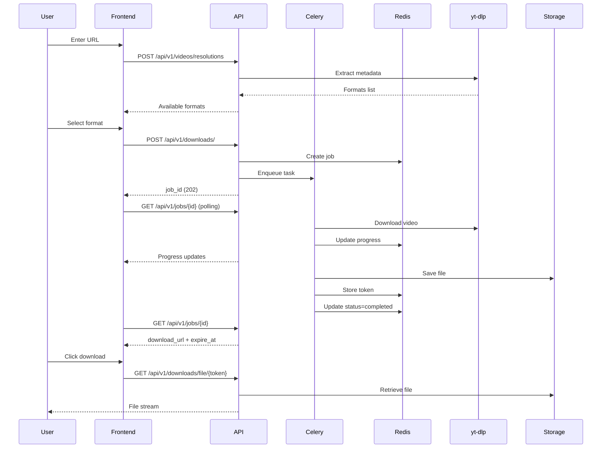
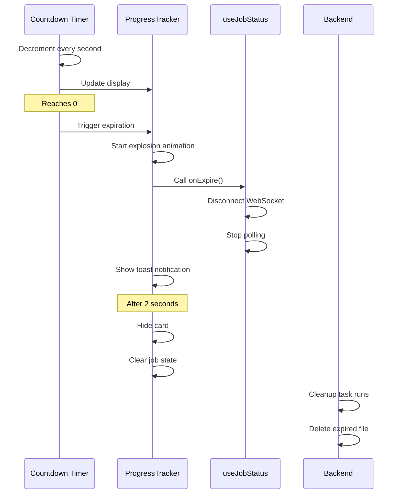
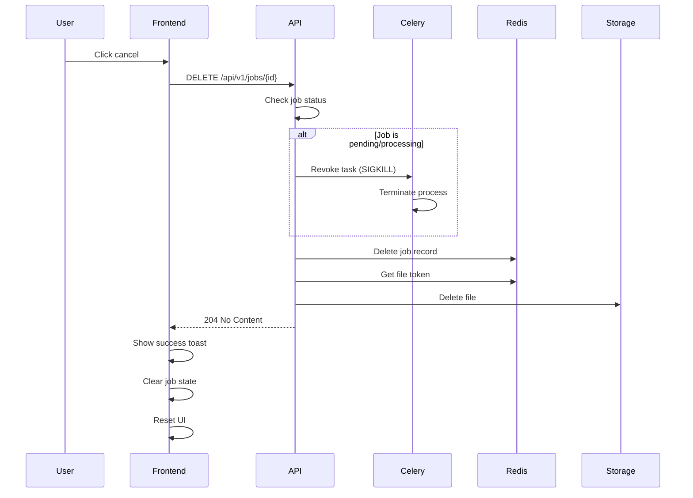
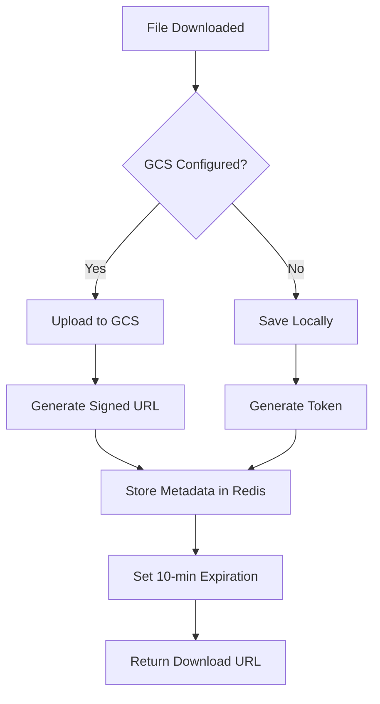
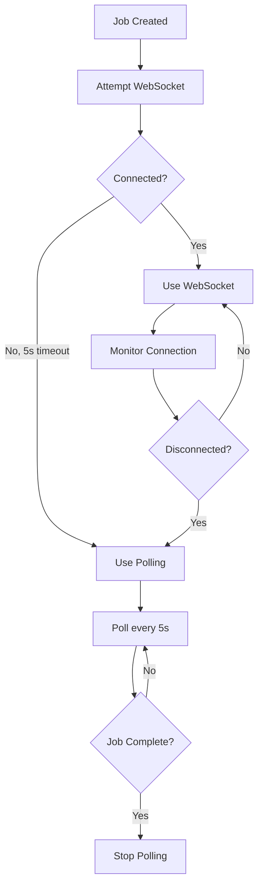
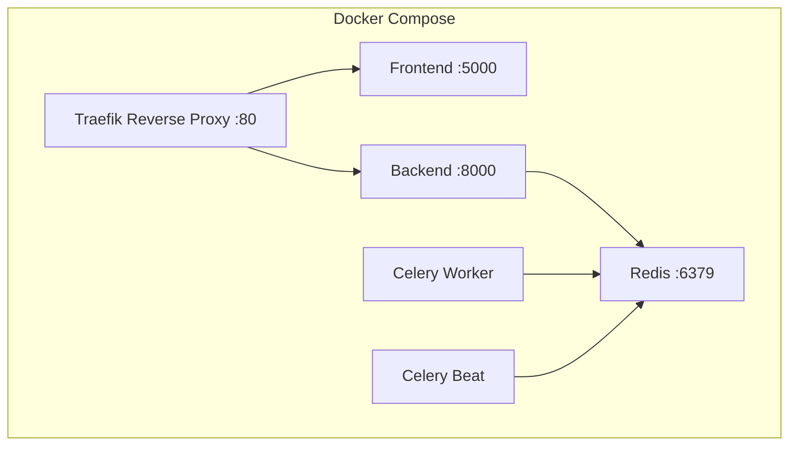

# UltraDL - Design Document

## 1. System Overview

UltraDL is a web-based YouTube video downloader built with a modern, scalable architecture. The system follows Domain-Driven Design (DDD) principles with clean separation of concerns across frontend, backend, and infrastructure layers.

### 1.1 Architecture Diagram



## 2. Frontend Design

### 2.1 Component Architecture



### 2.2 State Management Strategy

**Local Component State**:
- Form inputs (URL, selections)
- UI state (loading, expanded, etc.)
- Animation states

**Server State (TanStack Query)**:
- Job status and progress
- Video metadata
- Available formats

**WebSocket State**:
- Real-time progress updates
- Job completion events
- Error notifications

### 2.3 Key Design Patterns

#### 2.3.1 Progressive Enhancement
- Start with HTTP polling (works everywhere)
- Upgrade to WebSocket when available
- Automatic fallback on connection failure

#### 2.3.2 Optimistic UI Updates
- Show immediate feedback on user actions
- Update UI before server confirmation
- Rollback on error

#### 2.3.3 Error Boundaries
- Categorized error types
- User-friendly error messages
- Actionable guidance for resolution

### 2.4 Animation Design

**Explosion Animation** (on expiration):
```typescript
{
  scale: [1, 1.1, 0.9, 1.2, 0],
  opacity: [1, 0.8, 0.6, 0.3, 0],
  rotate: [0, -5, 5, -10, 0],
  filter: ["blur(0px)", "blur(2px)", "blur(4px)", "blur(8px)", "blur(20px)"],
  duration: 2000ms,
  timing: easeInOut
}
```

**Purpose**: Provide clear visual feedback that download has expired and is being removed.

### 2.5 Responsive Design

**Breakpoints**:
- Mobile: < 640px (1 column)
- Tablet: 640px - 1024px (2 columns)
- Desktop: > 1024px (3 columns)

**Mobile-First Approach**:
- Base styles for mobile
- Progressive enhancement for larger screens
- Touch-friendly targets (min 44px)

## 3. Backend Design

### 3.1 Domain-Driven Design Layers



### 3.2 Domain Models

#### 3.2.1 Job Management

```python
class DownloadJob:
    job_id: str
    status: JobStatus  # pending, processing, completed, failed
    progress: JobProgress
    download_token: Optional[str]
    error: Optional[str]
    error_category: Optional[ErrorCategory]
    created_at: datetime
    updated_at: datetime
```

#### 3.2.2 File Storage

```python
class DownloadedFile:
    token: str
    job_id: str
    file_path: str
    file_size: int
    content_type: str
    created_at: datetime
    expires_at: datetime
```

#### 3.2.3 Video Processing

```python
class VideoMetadata:
    id: str
    title: str
    uploader: str
    duration: int
    thumbnail: str
    formats: List[VideoFormat]

class VideoFormat:
    format_id: str
    ext: str
    resolution: str
    height: int
    vcodec: str
    acodec: str
    filesize: Optional[int]
```

### 3.3 Service Layer Design

#### 3.3.1 Job Service

**Responsibilities**:
- Create and manage download jobs
- Update progress atomically
- Handle job completion and failure
- Delete jobs and associated files

**Key Methods**:
```python
create_download_job(url: str, format_id: str) -> str
update_progress(job_id: str, progress: JobProgress) -> None
complete_job(job_id: str, download_url: str, expire_at: datetime) -> None
fail_job(job_id: str, error: str, category: ErrorCategory) -> None
delete_job(job_id: str) -> bool
```

#### 3.3.2 File Service

**Responsibilities**:
- Store files (GCS or local)
- Generate secure tokens
- Create signed URLs
- Delete expired files

**Key Methods**:
```python
register_downloaded_file(job_id: str, file_path: str) -> str
get_file_by_token(token: str) -> DownloadedFile
delete_file(token: str) -> bool
cleanup_expired_files() -> int
```

### 3.4 Repository Pattern

**Interface**:
```python
class JobRepository(ABC):
    @abstractmethod
    def save(self, job: DownloadJob) -> None
    
    @abstractmethod
    def get(self, job_id: str) -> Optional[DownloadJob]
    
    @abstractmethod
    def delete(self, job_id: str) -> bool
    
    @abstractmethod
    def update_progress(self, job_id: str, progress: JobProgress) -> None
```

**Implementation**: RedisJobRepository with atomic operations using Lua scripts.

### 3.5 Error Handling Strategy



**Error Categories**:
- INVALID_URL: URL validation failures
- VIDEO_UNAVAILABLE: Private/deleted videos
- FORMAT_NOT_SUPPORTED: Unavailable formats
- DOWNLOAD_FAILED: General download errors
- DOWNLOAD_TIMEOUT: Slow connection timeouts
- FILE_TOO_LARGE: Size limit exceeded
- RATE_LIMITED: Too many requests
- SYSTEM_ERROR: Unexpected errors
- JOB_NOT_FOUND: Missing jobs
- FILE_NOT_FOUND: Missing files
- FILE_EXPIRED: Expired download links
- GEO_BLOCKED: Region restrictions
- LOGIN_REQUIRED: Authentication needed
- PLATFORM_RATE_LIMITED: YouTube rate limiting

## 4. Data Flow Design

### 4.1 Download Flow



### 4.2 Expiration Flow



### 4.3 Cancellation Flow



## 5. Storage Design

### 5.1 Storage Strategy



### 5.2 File Cleanup Strategy

**Dual Cleanup Approach**:

1. **Application-Level** (Primary):
   - Celery beat task runs every 5 minutes
   - Queries Redis for expired tokens
   - Deletes files from storage
   - Removes metadata from Redis

2. **Storage-Level** (Safety Net):
   - GCS lifecycle rules (1-day retention)
   - Automatic deletion of old files
   - Backup cleanup mechanism

### 5.3 Token Generation

```python
def generate_secure_token() -> str:
    """Generate cryptographically secure token (32 bytes)."""
    return secrets.token_urlsafe(32)

def create_signed_url(token: str, expires_in: int = 600) -> str:
    """Create HMAC-signed URL with expiration."""
    expiry = int(time.time()) + expires_in
    message = f"{token}:{expiry}"
    signature = hmac.new(SECRET_KEY, message.encode(), hashlib.sha256).hexdigest()
    return f"/api/v1/downloads/file/{token}?signature={signature}&expires={expiry}"
```

## 6. Real-Time Communication Design

### 6.1 WebSocket vs Polling

**Decision Tree**:


### 6.2 WebSocket Events

**Client → Server**:
- `subscribe_job`: Subscribe to job updates
- `unsubscribe_job`: Unsubscribe from job
- `cancel_job`: Cancel active job
- `ping`: Connection health check

**Server → Client**:
- `job_progress`: Progress update
- `job_completed`: Job finished successfully
- `job_failed`: Job failed with error
- `job_cancelled`: Job cancelled by user
- `pong`: Health check response

## 7. Performance Optimization

### 7.1 Caching Strategy

**Redis Caching**:
- Job status: 1-hour TTL
- File metadata: 10-minute TTL
- Video metadata: No caching (always fresh)

**Browser Caching**:
- Static assets: 1 year
- API responses: No caching
- Download URLs: No caching

### 7.2 Connection Pooling

```python
redis_pool = redis.ConnectionPool(
    host=REDIS_HOST,
    port=REDIS_PORT,
    max_connections=20,
    socket_keepalive=True,
    socket_keepalive_options={
        socket.TCP_KEEPIDLE: 60,
        socket.TCP_KEEPINTVL: 10,
        socket.TCP_KEEPCNT: 3
    }
)
```

### 7.3 Async Processing

**Celery Configuration**:
- Soft time limit: 30 minutes (configurable)
- Hard time limit: 40 minutes (configurable)
- Task acknowledgment: Late (after completion)
- Result backend: Redis
- Broker: Redis

## 8. Security Design

### 8.1 Input Validation

**URL Validation**:
```python
YOUTUBE_REGEX = r'^(https?://)?(www\.)?(youtube\.com|youtu\.be|m\.youtube\.com)/.+'
```

**File Name Sanitization**:
```python
def sanitize_filename(filename: str) -> str:
    """Remove path traversal and special characters."""
    filename = os.path.basename(filename)
    filename = re.sub(r'[^\w\s.-]', '', filename)
    return filename[:255]  # Limit length
```

### 8.2 Token Security

**Requirements**:
- 32-byte cryptographically secure random tokens
- HMAC-SHA256 signatures for URLs
- Time-based expiration (10 minutes)
- Single-use tokens (deleted after download)

### 8.3 Rate Limiting

**Production Limits**:
- 200 requests/day per IP
- 50 requests/hour per IP
- 20 resolution requests/minute per IP
- 10 download requests/minute per IP
- 30 status polling requests/minute per IP

**Implementation**: Flask-Limiter with Redis storage

## 9. Monitoring and Logging

### 9.1 Logging Strategy

**Log Levels**:
- DEBUG: Detailed diagnostic information
- INFO: General informational messages
- WARNING: Warning messages (non-critical)
- ERROR: Error messages (handled)
- CRITICAL: Critical errors (unhandled)

**Log Context**:
- Request ID
- User IP (hashed)
- Job ID
- Timestamp
- Error category

### 9.2 Health Checks

**Endpoint**: GET /health

**Checks**:
- Backend: Flask app running
- Redis: Connection and ping
- Celery: Worker availability
- GCS: Bucket access (if configured)
- SocketIO: Server status (if enabled)

**Response**:
```json
{
  "status": "ok",
  "services": {
    "backend": "ok",
    "redis": "ok",
    "celery": "ok",
    "gcs": "not_configured",
    "socketio": "ok"
  }
}
```

## 10. Deployment Design

### 10.1 Container Architecture



### 10.2 Environment Configuration

**Development**:
- Rate limiting: Disabled
- Debug mode: Enabled
- Storage: Local filesystem
- WebSocket: Enabled
- Hot reload: Enabled

**Production**:
- Rate limiting: Enabled
- Debug mode: Disabled
- Storage: Google Cloud Storage
- WebSocket: Enabled
- Hot reload: Disabled

## 11. Future Enhancements

### 11.1 Planned Features

1. **User Authentication**
   - User accounts and login
   - Download history
   - Saved preferences

2. **Playlist Support**
   - Download entire playlists
   - Batch processing
   - Progress aggregation

3. **Advanced Filtering**
   - Filter by codec
   - Filter by file size
   - Custom quality presets

4. **Download Queue**
   - Queue multiple downloads
   - Priority management
   - Concurrent download limits

### 11.2 Scalability Improvements

1. **Horizontal Scaling**
   - Multiple backend instances
   - Load balancing
   - Session affinity

2. **Database Migration**
   - PostgreSQL for persistent data
   - Redis for caching only
   - Better query capabilities

3. **CDN Integration**
   - CloudFlare for static assets
   - Edge caching
   - DDoS protection
