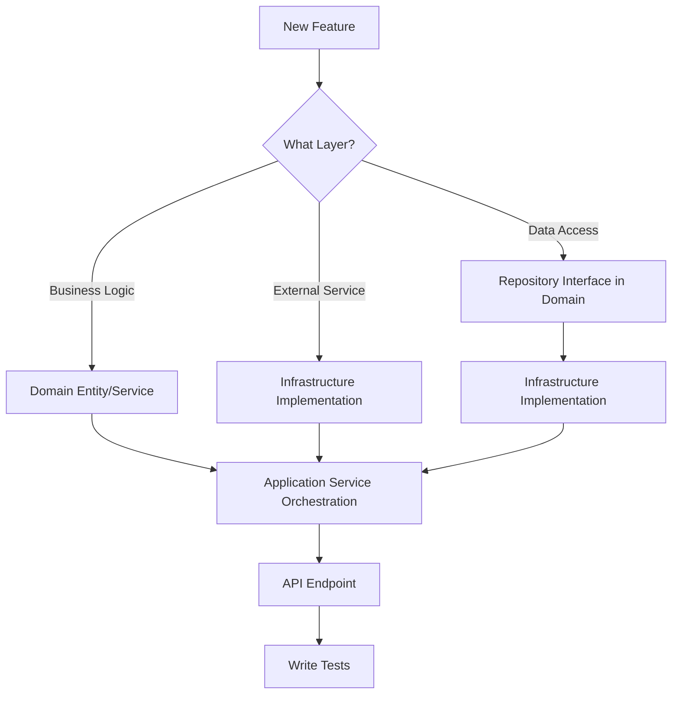

# Backend Development Guide

**For developers contributing to the UltraDL backend service.**

## 🚀 Quick Start

```bash
# Setup
cd backend
pip install -r requirements.txt

# Run with Docker
docker-compose up redis
python main.py

# Test (run as your user inside container)
docker-compose exec --user $(id -u):$(id -g) backend pytest -v

# Note: To prevent file ownership issues, ensure Docker runs as your user.
# Add 'user: "${UID}:${GID}"' to services in docker-compose.yml or use --user flag.
```

## 🏗️ Project Structure

```
backend/
├── api/             # REST endpoints (Flask-RESTX)
├── application/     # Use case orchestration
├── domain/          # Business logic (DDD)
├── infrastructure/  # External integrations
├── tasks/           # Celery background tasks
├── config/          # Configuration
└── tests/           # unit/, integration/, e2e/, contracts/
```

## 🎯 DDD Development Workflow



### Layer Rules (Strict)

**Domain Layer** (`domain/`)
- NO external dependencies (Flask, Redis, etc.)
- Pure business logic only
- Define repository interfaces here
- Use domain events for communication

**Application Layer** (`application/`)
- Orchestrate domain operations
- Call domain services
- Publish events
- Handle transactions

**Infrastructure Layer** (`infrastructure/`)
- Implement repository interfaces
- External service integrations (Redis, GCS)
- Event handlers

**API Layer** (`api/v1/`)
- Thin controllers
- Delegate to application services
- Input validation only

**Tasks Layer** (`tasks/`)
- Access domain via application services only
- No direct domain imports

### Feature Implementation Steps

1. **Domain Entity** - Create entity with business logic in `domain/`
2. **Repository Interface** - Define in `domain/`, implement in `infrastructure/`
3. **Application Service** - Orchestrate workflow in `application/`
4. **API Endpoint** - Add thin controller in `api/v1/`
5. **Tests** - Unit (domain), integration (infrastructure), e2e (API)

## ✅ Testing

### Test Structure

Tests are organized by type in the `tests/` directory:

```
tests/
├── unit/          # Fast isolated tests (domain, application logic)
├── integration/   # Tests with external services (Redis, GCS, API)
├── contracts/     # Repository interface compliance tests
└── e2e/          # End-to-end workflow tests
```

### Where to Add Tests

**Unit Tests** (`tests/unit/`)
- Domain entities and value objects
- Domain services (business logic)
- Application services (use case orchestration)
- Service locator and dependency container
- **No external dependencies** - use mocks/stubs
- **Fast execution** - should complete in < 1 second

**Integration Tests** (`tests/integration/`)
- Infrastructure implementations (Redis, GCS, local file storage)
- Repository implementations with real services
- Event handlers and publishers
- API endpoints with Flask test client
- Celery tasks with task execution
- App factory and configuration
- **Real external services** - requires Redis, file system, etc.
- **Slower execution** - may take seconds per test

**Contract Tests** (`tests/contracts/`)
- Repository interface compliance
- Verify all interface methods are implemented
- Verify implementations follow interface contracts
- Can use real or mock dependencies

**E2E Tests** (`tests/e2e/`)
- Complete user workflows through API
- Full download flow from URL submission to file retrieval
- Error scenarios end-to-end
- **Slowest execution** - may take minutes

### Test Naming Conventions

**File naming:**
- `test_<module_name>.py` (e.g., `test_job_service.py`)

**Class naming:**
- `Test<ClassName>` (e.g., `TestJobService`)

**Function naming:**
- `test_<behavior>_<expected_result>` (e.g., `test_create_job_returns_job_id`)

### Commands

```bash
# Run all tests
pytest -v

# Run by test type
pytest tests/unit/ -v                                  # Unit tests only (fast)
pytest tests/integration/ -v                           # Integration tests only
pytest tests/contracts/ -v                             # Contract tests only
pytest tests/e2e/ -v                                  # E2E tests only

# Run specific test file
pytest tests/unit/test_job_service.py -v

# Run with coverage
pytest --cov=. --cov-report=html --cov-report=term-missing
pytest tests/unit/ --cov=domain --cov=application      # Unit test coverage

# Run with markers (if configured in pytest.ini)
pytest -m unit                                         # Unit tests
pytest -m integration                                  # Integration tests
pytest -m "not integration"                            # Skip integration tests
```

### Test Patterns

```python
# Unit (Domain) - Pure logic, no dependencies
def test_job_state_transition():
    job = DownloadJob.create(url, format_id)
    job.start()
    assert job.status == JobStatus.PROCESSING

# Unit (Application) - Mock infrastructure dependencies
def test_job_service_create_job(mocker):
    mock_repo = mocker.Mock(spec=JobRepository)
    service = JobService(mock_repo)
    job_id = service.create_job(url, format_id)
    assert mock_repo.save.called

# Integration (Infrastructure) - Real Redis/GCS
def test_redis_repository_save(redis_client):
    repo = RedisJobRepository(redis_client)
    job = DownloadJob.create(url, format_id)
    assert repo.save(job) is True
    assert repo.get(job.id) == job

# Contract (Repository) - Verify interface compliance
def test_repository_implements_interface():
    repo = RedisJobRepository(redis_client)
    assert isinstance(repo, JobRepository)
    assert hasattr(repo, 'save')
    assert hasattr(repo, 'get')

# E2E (API) - Full workflow
def test_download_workflow(client):
    # Create job
    response = client.post('/api/v1/downloads/', json=data)
    assert response.status_code == 201
    job_id = response.json['job_id']

    # Check status
    response = client.get(f'/api/v1/jobs/{job_id}')
    assert response.status_code == 200
```

### Coverage Requirements
- New code: 90%+ | Domain: 95%+ | Application: 95%+

### Testing Guidelines

**When writing tests:**
1. Start with unit tests for domain logic
2. Add integration tests for infrastructure implementations
3. Add contract tests to verify repository compliance
4. Add E2E tests for critical user workflows
5. Use descriptive test names that explain the behavior
6. Keep tests focused on one behavior per test
7. Use fixtures for common setup (conftest.py)
8. Mock external dependencies in unit tests
9. Use real services in integration tests
10. Follow the Arrange-Act-Assert pattern

## 🎨 Code Patterns

### Python Style

```python
# Type hints required
def process(job_id: str) -> DownloadResult: pass

# Dataclasses for entities
@dataclass
class Entity:
    id: str

# ABC for interfaces
class Repository(ABC):
    @abstractmethod
    def save(self): pass
```

### Common Patterns

**Repository Pattern:**
```python
# domain/repositories.py - Interface
class JobRepository(ABC):
    @abstractmethod
    def save(self, job: DownloadJob) -> bool: pass

# infrastructure/redis_job_repository.py - Implementation
class RedisJobRepository(JobRepository):
    def save(self, job: DownloadJob) -> bool:
        return self.redis.set(f"job:{job.id}", job.to_dict())
```

**Domain Events:**
```python
# domain/events.py
@dataclass
class JobCompletedEvent:
    job_id: str
    timestamp: datetime

# application/service.py
def complete_job(self, job_id: str):
    job = self.repo.get(job_id)
    job.complete()
    self.event_publisher.publish(JobCompletedEvent(job_id, now()))
```

## 🐛 Debugging

```bash
# Flask API
FLASK_DEBUG=true python main.py

# Celery tasks
celery -A celery_app worker --loglevel=debug
celery -A celery_app inspect active

# Redis
docker exec -it ultradl_redis redis-cli
MONITOR
KEYS job:*
```

## 📦 Dependencies

```bash
# Add package
echo "package-name==1.0.0" >> requirements.txt
pip install -r requirements.txt
docker-compose build backend
```

## 🔄 Development Checklist

**Pre-commit:**
- [ ] Tests pass (pytest -v)
- [ ] Coverage ≥ 90%
- [ ] Type hints added
- [ ] No linting errors

**Git Commits:**
```bash
git commit -m "feat: add feature"
git commit -m "fix: resolve bug"
git commit -m "refactor: improve code"
```

## 🔐 Security & Performance

**Security:**
- Validate all input
- Use rate limiting (production only)
- Never commit secrets (use .env)
- Sanitize error responses

**Performance:**
- Use Redis batch operations
- Cache frequently accessed data
- Profile slow endpoints
- Monitor Celery task execution

## 📚 Resources

- [ARCHITECTURE.md](./ARCHITECTURE.md) - DDD layer design
- [README.md](./README.md) - API reference & setup
- [PROJECT_GUIDE.md](../PROJECT_GUIDE.md) - Project standards
