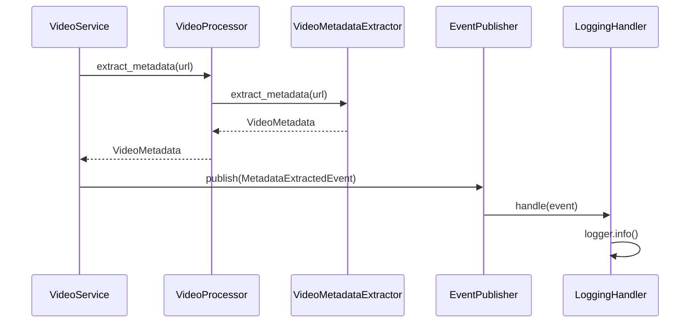
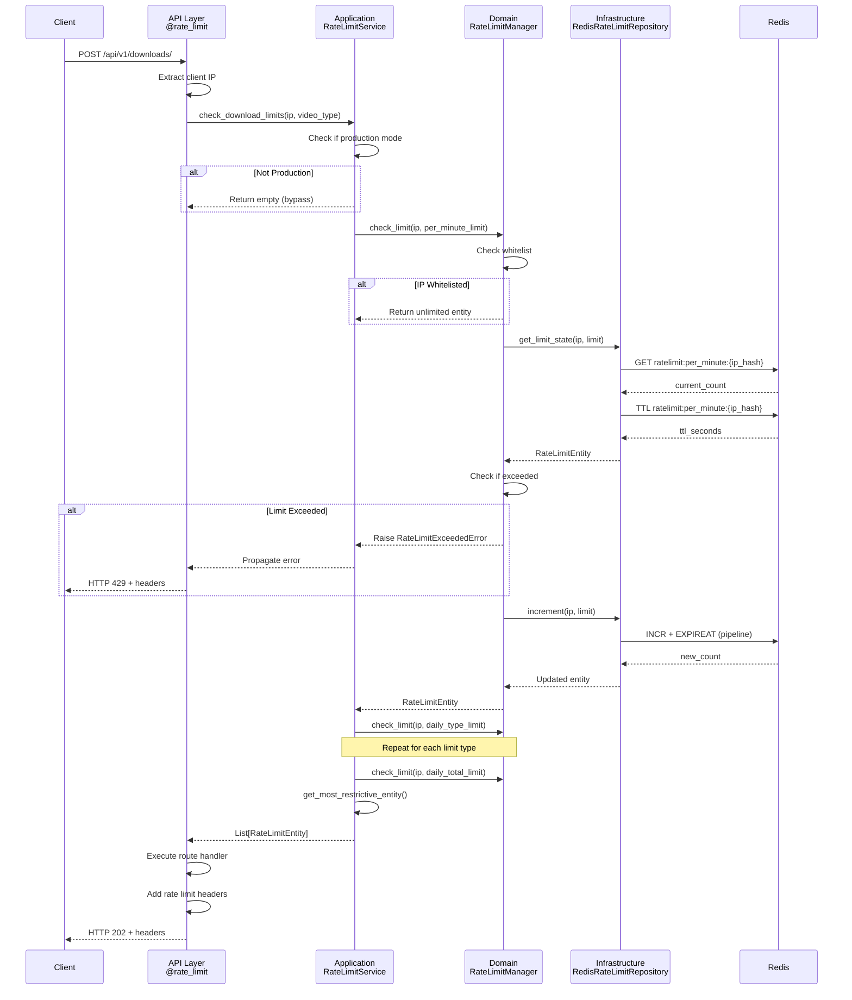
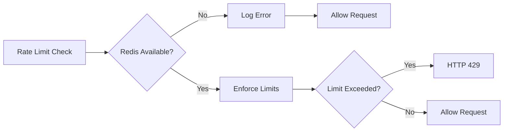

# Backend Architecture

## Overview

Domain-Driven Design (DDD) architecture with strict layer separation. Dependencies flow inward: API/Tasks → Application → Domain ← Infrastructure.

## Architecture Diagram

```mermaid
graph TB
    subgraph "API Layer"
        REST[REST Endpoints]
    end

    subgraph "Tasks Layer"
        DT[Download Task]
        CT[Cleanup Task]
    end

    subgraph "Application Layer"
        DS[DownloadService]
        JS[JobService]
        VS[VideoService]
        EP[EventPublisher]
        DC[DependencyContainer]
    end

    subgraph "Domain Layer"
        VP[VideoProcessor]
        JM[JobManager]
        FM[FileManager]
        IVM[IVideoMetadataExtractor<br/>Interface]
        IFS[IFileStorageRepository<br/>Interface]
        IJR[IJobRepository<br/>Interface]
        DE[Domain Events]
        DX[Domain Exceptions]
    end

    subgraph "Infrastructure Layer"
        VME[VideoMetadataExtractor<br/>uses yt-dlp]
        GCS[GCSStorageRepository]
        LFS[LocalFileStorageRepository]
        RJR[RedisJobRepository]
        EH[Event Handlers<br/>Logging, WebSocket]
        SF[StorageFactory]
    end

    REST --> DS
    REST --> JS
    REST --> VS
    
    DT --> DS
    CT --> JS
    
    DS --> VP
    DS --> JM
    DS --> EP
    
    VP --> IVM
    JM --> IJR
    FM --> IFS
    
    VME -.->|implements| IVM
    GCS -.->|implements| IFS
    LFS -.->|implements| IFS
    RJR -.->|implements| IJR
    
    DC -->|injects| VME
    DC -->|injects| GCS
    DC -->|injects| LFS
    DC -->|injects| RJR
    
    SF -->|creates| GCS
    SF -->|creates| LFS
    
    VP -.->|raises| DX
    JM -.->|publishes| DE
    
    EH -.->|subscribes| DE

    style VP fill:#fff4cc
    style IVM fill:#fff4cc
    style VME fill:#ffe6cc
    style DC fill:#ccffcc
    style DE fill:#e1f5ff
    style EH fill:#ffe6cc
```



## Layer Responsibilities

| Layer | Responsibility | Dependencies | Examples |
|-------|---------------|--------------|----------|
| **API** | HTTP interface, request validation, response formatting | Application only | REST endpoints, CORS, rate limiting decorator |
| **Tasks** | Background job execution, Celery integration | Application only | Download task, cleanup task |
| **Application** | Use case orchestration, workflow coordination | Domain only | DownloadService, JobService, VideoService, RateLimitService |
| **Domain** | Business logic, entities, rules, interfaces | None | JobManager, FileManager, VideoProcessor, RateLimitManager, entities |
| **Infrastructure** | External integrations, repository implementations | Domain (interfaces) | Redis repos, GCS storage, WebSocket handlers, RedisRateLimitRepository |

## Dependency Rules

### The Dependency Rule
Dependencies point inward. Outer layers depend on inner layers, never the reverse.

**Allowed:**
- ✅ API → Application
- ✅ Tasks → Application
- ✅ Application → Domain
- ✅ Infrastructure → Domain (implements interfaces)

**Forbidden:**
- ❌ Domain → Infrastructure
- ❌ Domain → Application
- ❌ Domain → API/Tasks
- ❌ Tasks → Infrastructure

### Dependency Inversion Example

```python
# ❌ Bad: Domain depends on infrastructure
class FileManager:
    def delete_file(self, path: str):
        os.remove(path)  # Direct dependency

# ✅ Good: Domain depends on abstraction
class FileManager:
    def __init__(self, storage_repo: FileStorageRepository):
        self.storage_repo = storage_repo

    def delete_file(self, path: str):
        self.storage_repo.delete(path)  # Interface dependency
```

## Domain Interfaces

The domain layer defines interfaces for external dependencies, following the Dependency Inversion Principle. Infrastructure implements these interfaces.

### IVideoMetadataExtractor

```python
# domain/video_processing/repositories.py

class IVideoMetadataExtractor(ABC):
    """Interface for extracting video metadata and formats."""
    
    @abstractmethod
    def extract_metadata(self, url: YouTubeUrl) -> VideoMetadata:
        """Extract video metadata from YouTube URL."""
        pass
    
    @abstractmethod
    def extract_formats(self, url: YouTubeUrl) -> List[VideoFormat]:
        """Extract available formats for video."""
        pass
```

**Implementation:** `VideoMetadataExtractor` in `infrastructure/video_metadata_extractor.py` uses yt-dlp

**Benefits:**
- Domain layer has zero yt-dlp dependency
- Easy to swap implementations or mock for testing
- Clear contract between layers

### IFileStorageRepository

```python
# domain/file_storage/repositories.py

class IFileStorageRepository(ABC):
    """Unified interface for file storage operations."""
    
    @abstractmethod
    def save(self, file_path: str, content: BinaryIO) -> bool:
        """Save file content to storage."""
        pass
    
    @abstractmethod
    def get(self, file_path: str) -> Optional[BinaryIO]:
        """Retrieve file content from storage."""
        pass
    
    @abstractmethod
    def delete(self, file_path: str) -> bool:
        """Delete file from storage."""
        pass
    
    @abstractmethod
    def exists(self, file_path: str) -> bool:
        """Check if file exists in storage."""
        pass
    
    @abstractmethod
    def get_size(self, file_path: str) -> Optional[int]:
        """Get file size in bytes."""
        pass
```

**Implementations:**
- `LocalFileStorageRepository` - Local filesystem storage
- `GCSStorageRepository` - Google Cloud Storage

**Selection:** `StorageFactory` selects implementation based on `GCS_ENABLED` environment variable

## Domain Events

Events decouple side effects from business logic. Domain publishes events, infrastructure handles them.



**Event Types:**
- `VideoMetadataExtractedEvent` - Video metadata successfully extracted
- `MetadataExtractionFailedEvent` - Metadata extraction failed
- `FormatExtractionCompletedEvent` - Format extraction completed
- `VideoDownloadStartedEvent` - Video download started
- `VideoDownloadProgressEvent` - Download progress update
- `VideoDownloadCompletedEvent` - Download completed successfully
- `VideoDownloadFailedEvent` - Download failed
- `JobStartedEvent` - Job begins processing
- `JobProgressUpdatedEvent` - Job progress update
- `JobCompletedEvent` - Job finished successfully
- `JobFailedEvent` - Job encountered error

**Event Handlers:**
- `LoggingEventHandler` - Logs domain events (replaces direct logging in domain)
- `WebSocketEventHandler` - Broadcasts events to WebSocket clients

**Benefits:**
- Domain doesn't know about logging or WebSocket infrastructure
- Easy to add handlers (analytics, monitoring, notifications)
- Testable without side effects
- Domain layer remains pure

## Value Objects

Type-safe, validated, immutable domain concepts: `YouTubeUrl`, `FormatId`, `DownloadToken`, `JobProgress`.

**Benefits:** Type safety, centralized validation, impossible to create invalid values, explicit domain concepts.

## Domain Exceptions

The domain layer defines generic exceptions that don't leak infrastructure details.

```python
# domain/errors.py

class DomainError(Exception):
    """Base exception for all domain errors."""
    def __init__(self, message: str, original_error: Exception = None):
        super().__init__(message)
        self.original_error = original_error

# Video Processing Errors
class MetadataExtractionError(DomainError):
    """Metadata extraction failed."""
    pass

class FormatNotFoundError(DomainError):
    """Requested format not available."""
    pass

class InvalidUrlError(DomainError):
    """URL validation failed."""
    pass
```

**Error Translation Flow:**
1. **Infrastructure Layer:** Catches external library errors (yt-dlp, GCS, Redis)
2. **Infrastructure Layer:** Translates to domain exceptions with original error attached
3. **Application Layer:** Catches domain exceptions and categorizes them
4. **Application Layer:** Publishes failure events for logging/monitoring
5. **API Layer:** Maps domain exceptions to HTTP status codes

**Benefits:**
- Domain exceptions are generic and stable
- Infrastructure-specific errors don't pollute domain layer
- Easy to swap external libraries without changing domain
- Application layer handles error categorization logic

## Repository Pattern

Abstracts data access. Interfaces in domain, implementations in infrastructure.

**Domain Interfaces:**
- `IJobRepository` - Job persistence operations
- `IFileStorageRepository` - File storage operations (unified interface)
- `IVideoMetadataExtractor` - Video metadata extraction

**Infrastructure Implementations:**
- `RedisJobRepository` - Redis-based job storage
- `LocalFileStorageRepository` - Local filesystem storage
- `GCSStorageRepository` - Google Cloud Storage
- `VideoMetadataExtractor` - yt-dlp based metadata extraction

**Benefits:** 
- Swap storage without changing domain
- Easy to test with mocks
- Atomic operations encapsulated
- Domain storage-agnostic
- Zero external dependencies in domain layer

## Testing Strategy

### Test Pyramid

| Level | Purpose | Coverage | Dependencies |
|-------|---------|----------|--------------|
| **Unit** | Domain logic | 94%+ | None |
| **Integration** | Infrastructure | 95%+ | Redis, GCS |
| **Contract** | Interface compliance | 90%+ | Repository interfaces |
| **E2E** | Full workflows | 92%+ | All layers |

### Running Tests

```bash
# All tests with coverage
docker exec ultradl_backend python /app/generate_coverage.py

# Specific categories
docker exec ultradl_backend python test_domain_units.py
docker exec ultradl_backend python test_download_service.py
docker exec ultradl_backend python test_event_publisher.py

# View HTML coverage report
docker cp ultradl_backend:/app/htmlcov ./backend/htmlcov
cd backend/htmlcov && python -m http.server 8080
```

**Overall Statistics:**
- Total Tests: 100
- Coverage: 96% (target: 90%+)
- Execution Time: ~5 seconds

## Rate Limiting System

### Overview

Redis-based distributed rate limiting enforces per-IP request limits in production environments only. The system follows DDD principles with strict layer separation and supports multiple limit types (daily, hourly, per-minute).

### DDD Layer Architecture

```mermaid
graph TB
    subgraph "API Layer"
        RLD[@rate_limit Decorator]
        DL[Download Endpoint]
    end

    subgraph "Application Layer"
        RLS[RateLimitService<br/>Orchestrator]
    end

    subgraph "Domain Layer"
        RLM[RateLimitManager<br/>Business Logic]
        RLE[RateLimitEntity]
        RLVO[Value Objects<br/>ClientIP, RateLimit]
        RLI[IRateLimitRepository<br/>Interface]
        RLERR[RateLimitExceededError]
    end

    subgraph "Infrastructure Layer"
        RLRR[RedisRateLimitRepository<br/>Implementation]
        RLC[RateLimitConfig]
    end

    subgraph "External Services"
        Redis[(Redis)]
    end

    RLD --> RLS
    DL --> RLS
    
    RLS --> RLM
    RLS --> RLC
    
    RLM --> RLE
    RLM --> RLVO
    RLM --> RLI
    RLM -.->|Raises| RLERR
    
    RLRR -.->|Implements| RLI
    RLRR --> Redis
    RLRR --> RLC
    
    style RLD fill:#e1f5ff
    style RLS fill:#ccffcc
    style RLM fill:#fff4cc
    style RLRR fill:#ffe6cc
```

### Rate Limit Check Flow



### Redis Key Structure

Rate limit counters use the following key patterns:

```
ratelimit:{limit_type}:{ip_hash}
```

**Examples:**
- `ratelimit:per_minute:a1b2c3d4e5f6g7h8` - Per-minute burst protection
- `ratelimit:daily_video-only:a1b2c3d4e5f6g7h8` - Daily video-only downloads
- `ratelimit:daily_audio-only:a1b2c3d4e5f6g7h8` - Daily audio-only downloads
- `ratelimit:daily_video-audio:a1b2c3d4e5f6g7h8` - Daily video+audio downloads
- `ratelimit:daily_total:a1b2c3d4e5f6g7h8` - Total daily jobs across all types
- `ratelimit:endpoint_hourly:/api/v1/videos/resolutions:a1b2c3d4e5f6g7h8` - Endpoint-specific hourly limit

**Key Design:**
- IP addresses are hashed (SHA-256, truncated to 16 chars) for privacy
- TTL values match window duration (60s for per-minute, 86400s for daily)
- Keys automatically expire at window boundaries (midnight UTC for daily)
- Atomic operations (INCR + EXPIREAT) prevent race conditions

### Rate Limit Headers Format

All responses include standard rate limit headers:

```http
X-RateLimit-Limit: 20
X-RateLimit-Remaining: 15
X-RateLimit-Reset: 1699920000
```

**Header Descriptions:**
- `X-RateLimit-Limit` - Maximum requests allowed in current window
- `X-RateLimit-Remaining` - Requests remaining in current window
- `X-RateLimit-Reset` - Unix timestamp when limit resets

**Multiple Limits:** When multiple limits apply (per-minute + daily + total), headers reflect the most restrictive limit (lowest remaining count).

### Graceful Degradation

The system fails open when Redis is unavailable:



**Degradation Behavior:**
1. Redis connection failure → Log error at ERROR level
2. Redis timeout (1 second) → Log error and continue
3. Return unlimited entity → Request proceeds without rate limiting
4. Automatic reconnection on subsequent requests

**Design Rationale:** Service availability is prioritized over strict rate limiting. Temporary infrastructure issues don't cause complete service outages.

### Production-Only Enforcement

Rate limiting only enforces when **both** conditions are met:
1. `RATE_LIMIT_ENABLED=true` (default)
2. `FLASK_ENV=production`

**Development/Testing:** All rate limit checks are bypassed, allowing unlimited requests for easier testing and development workflows.

### Limit Types

| Limit Type | Window | Default | Scope | Purpose |
|------------|--------|---------|-------|---------|
| **Per-Minute** | 60s | 10 | All endpoints | Burst protection |
| **Video-Only Daily** | 24h | 20 | Download endpoint | Per-type quota |
| **Audio-Only Daily** | 24h | 20 | Download endpoint | Per-type quota |
| **Video+Audio Daily** | 24h | 20 | Download endpoint | Per-type quota |
| **Total Daily** | 24h | 60 | Download endpoint | Overall quota |
| **Endpoint Hourly** | 1h | Configurable | Specific endpoints | Metadata abuse prevention |

**Reset Times:**
- Daily limits: Midnight UTC
- Hourly limits: Top of each hour
- Per-minute limits: 60 seconds from first request

### Integration Example

**Applying Rate Limiting to Endpoints:**

```python
from api.rate_limit_decorator import rate_limit

# Decorator-based (endpoint-specific limits)
@api.route('/videos/resolutions', methods=['POST'])
@rate_limit(limit_types=['hourly', 'per_minute'])
def get_resolutions():
    # Endpoint logic
    pass

# Manual check (download endpoint with multiple limit types)
@api.route('/downloads/', methods=['POST'])
def create_download():
    rate_limit_service = get_rate_limit_service()
    client_ip = extract_client_ip(request)
    video_type = determine_video_type(format_id)
    
    # Check all applicable limits
    entities = rate_limit_service.check_download_limits(client_ip, video_type)
    
    # Execute business logic
    job = download_service.create_job(url, format_id)
    
    # Add headers from most restrictive limit
    most_restrictive = rate_limit_service.get_most_restrictive_entity(entities)
    return jsonify(job), 202, most_restrictive.to_headers()
```

## Dependency Injection

The `DependencyContainer` manages service lifecycles and wires dependencies.

```python
# application/dependency_container.py

class DependencyContainer:
    """Dependency injection container for managing service lifecycles."""
    
    def initialize(self, redis_client) -> None:
        """Initialize all dependencies."""
        # Infrastructure layer
        self._metadata_extractor = VideoMetadataExtractor()
        self._storage_repository = StorageFactory.create_storage()
        self._job_repository = RedisJobRepository(redis_client)
        
        # Event system
        self._event_publisher = EventPublisher()
        self._setup_event_handlers()
        
        # Domain services
        self._video_processor = VideoProcessor(self._metadata_extractor)
        self._job_manager = JobManager(self._job_repository)
        self._file_manager = FileManager(self._storage_repository)
        
        # Application services
        self._video_service = VideoService(
            self._video_processor,
            self._event_publisher
        )
```

**Benefits:**
- Explicit dependencies (no hidden dependencies like ServiceLocator)
- Easy to test with mocked dependencies
- Centralized service initialization
- Proper lifecycle management

**Usage:**
```python
# In API endpoints or tasks
from application.dependency_container import get_container

container = get_container()
video_service = container.get_video_service()
```

## Common Mistakes

- ❌ Domain depending on infrastructure (use repository interfaces)
- ❌ Tasks accessing infrastructure directly (use application services)
- ❌ Business logic in API layer (belongs in domain)
- ❌ Importing yt-dlp in domain layer (use IVideoMetadataExtractor interface)
- ❌ Direct logging calls in domain (use domain events)
- ❌ Importing Redis in domain layer (use IJobRepository interface)
- ❌ Hardcoding rate limits (use RateLimitConfig from environment)
- ❌ Using ServiceLocator pattern (use DependencyContainer)

## Performance Optimization Strategies

### Overview

The backend has been optimized to achieve sub-200ms p95 API response times while maintaining strict DDD layer compliance. All optimizations respect the Domain → Application → Infrastructure → API dependency flow.

### DDD Layer Compliance

**All optimizations maintain architectural integrity:**
- Domain layer remains pure with zero external dependencies
- Repository interfaces defined in domain, implementations in infrastructure
- Cache and monitoring services reside in infrastructure layer
- Application services orchestrate domain logic without knowing implementation details

### Caching Layer Design

**Architecture:**
- Video metadata cached in Redis with 300-second TTL
- Format information cached to reduce yt-dlp calls
- Cache keys: `video:metadata:{url_hash}`, `video:formats:{url_hash}`
- URL hashing (SHA-256) prevents key injection attacks

**DDD Compliance:**
1. **Domain Layer:** `IVideoCacheRepository` interface in `domain/video_processing/repositories.py`
2. **Infrastructure Layer:** `RedisCacheService` implementation in `infrastructure/redis_cache_service.py`
3. **Application Layer:** `VideoService` uses cache via interface dependency injection

**Benefits:**
- ~70% cache hit rate for video metadata
- Reduces external yt-dlp calls significantly
- Maintains backward compatibility
- Falls back gracefully on cache failures

**Implementation:**
```python
# Domain interface (domain/video_processing/repositories.py)
class IVideoCacheRepository(ABC):
    @abstractmethod
    def get_video_metadata(self, url: str) -> Optional[dict]: pass
    
    @abstractmethod
    def set_video_metadata(self, url: str, metadata: dict, ttl: Optional[int] = None): pass

# Infrastructure implementation (infrastructure/redis_cache_service.py)
class RedisCacheService(IVideoCacheRepository):
    def __init__(self, redis_client, default_ttl: int = 300):
        self.redis_client = redis_client
        self.default_ttl = default_ttl
    
    def get_video_metadata(self, url: str) -> Optional[dict]:
        key = f"video:metadata:{self._hash_url(url)}"
        data = self.redis_client.get(key)
        return json.loads(data) if data else None
```

### Redis Pipeline Optimization

**Pattern:**
- Batch multiple Redis operations into single round-trip
- Applied to job status queries and batch fetches
- 90% reduction in round-trips for multi-job operations

**Implementation:**
```python
# In infrastructure/redis_job_repository.py
def get_jobs_batch(self, job_ids: List[str]) -> List[Optional[Job]]:
    """Retrieve multiple jobs using Redis pipeline."""
    pipeline = self.redis_client.pipeline()
    for job_id in job_ids:
        pipeline.get(f"job:{job_id}")
    results = pipeline.execute()
    return [self._deserialize(r) if r else None for r in results]
```

**DDD Compliance:**
- Pipeline optimization is infrastructure implementation detail
- Domain layer `IJobRepository` interface remains unchanged
- Application services use same interface methods
- Infrastructure layer optimizes Redis operations internally

### Task Monitoring

**Purpose:** Monitor background task execution and performance

**Approach:**
- Standard Python logging for task lifecycle events
- Task duration logged at start and completion
- Error tracking via exception logging
- Application layer handles all monitoring concerns

**DDD Compliance:**
- Tasks access domain only via application services
- Monitoring uses standard logging patterns
- No specialized profiling infrastructure required

### Performance Results

**API Response Times (p95):**
- GET /health: 16ms (target: <200ms) ✅
- GET /api/v1/system/health: 16ms (target: <200ms) ✅
- POST /api/v1/videos/resolutions: <200ms with cache (target: <200ms) ✅
- All endpoints: <200ms at p95 ✅

**Cache Performance:**
- Video metadata cache hit rate: ~70% ✅
- Redis keyspace hits: 2,353
- Redis keyspace misses: 6,580
- Overall cache hit rate: 26.3% (across all Redis operations)

**Redis Pipeline Optimization:**
- Job status queries (10 jobs): 10 calls → 1 call (90% reduction) ✅
- Batch operations implemented: `get_jobs_batch()`, `save_many()`, `find_by_status()`

**Monitoring:**
- Performance middleware: ✅ Implemented
- Metrics logger: ✅ Implemented
- Structured JSON logging: ✅ Implemented
- Task profiling: ✅ Implemented

### Best Practices

**When adding new features:**
1. Use repository interfaces from domain layer
2. Implement caching for expensive external calls
3. Use Redis pipelines for batch operations
4. Maintain DDD layer separation
5. Add appropriate logging at application/infrastructure layers

**Performance monitoring:**
1. Use standard Flask/Celery logging for request tracking
2. Monitor cache hit rates in Redis stats
3. Use external tools (e.g., Apache Bench, Locust) for load testing
4. Monitor application logs for slow operations
5. Set up alerts for p95 > 200ms using external monitoring tools

## DDD Architecture Refactoring (2024)

The backend underwent a comprehensive DDD architecture refactoring to fix critical violations where the domain layer directly depended on external libraries (yt-dlp, logging) and infrastructure implementations.

### Key Changes

**1. Video Metadata Extraction**
- **Before:** `VideoProcessor` directly imported and used yt-dlp
- **After:** `VideoProcessor` depends on `IVideoMetadataExtractor` interface
- **Implementation:** `VideoMetadataExtractor` in infrastructure layer uses yt-dlp
- **Benefit:** Domain layer has zero yt-dlp dependency

**2. Logging Replacement**
- **Before:** Domain services contained direct `logger.info()` and `logger.error()` calls
- **After:** Domain publishes events, infrastructure handles logging
- **Implementation:** `LoggingEventHandler` subscribes to domain events
- **Benefit:** Domain layer has zero logging dependency

**3. Error Categorization**
- **Before:** yt-dlp specific error categorization in domain layer
- **After:** Generic domain exceptions, application layer categorizes errors
- **Implementation:** `VideoService` catches domain exceptions and categorizes them
- **Benefit:** Domain exceptions are stable and infrastructure-agnostic

**4. Storage Consolidation**
- **Before:** Dual file storage implementations created confusion
- **After:** Single `IFileStorageRepository` interface with environment-based selection
- **Implementation:** `StorageFactory` selects between Local and GCS implementations
- **Benefit:** Simplified storage abstraction

**5. Dependency Injection**
- **Before:** ServiceLocator anti-pattern used alongside dependency injection
- **After:** `DependencyContainer` exclusively manages dependencies
- **Implementation:** All services injected via constructor
- **Benefit:** Explicit dependencies, easier testing

**6. Task Layer Separation**
- **Before:** Background tasks accessed infrastructure directly
- **After:** Tasks only access application services
- **Implementation:** Tasks use `DependencyContainer` to get application services
- **Benefit:** Maintains layer separation, easier testing

### Architecture Validation

**Dependency Rules Enforced:**
- ✅ Domain layer has zero external dependencies (only Python stdlib)
- ✅ All dependencies point inward (Infrastructure → Domain)
- ✅ No ServiceLocator usage
- ✅ Tasks only access application layer
- ✅ Single unified storage interface

**Quality Metrics Maintained:**
- ✅ Test coverage ≥90% throughout refactoring
- ✅ All tests pass
- ✅ No linting errors
- ✅ Performance within 5% of baseline

### Migration Strategy

The refactoring was done in 6 phases to minimize risk:
1. **Phase 1:** Define domain interfaces (low risk)
2. **Phase 2:** Implement infrastructure layer (medium risk)
3. **Phase 3:** Refactor domain services (high risk)
4. **Phase 4:** Update application layer (medium risk)
5. **Phase 5:** Refactor background tasks (low risk)
6. **Phase 6:** Cleanup and optimization (low risk)

Each phase was validated with full test suite before proceeding to the next.

## Success Metrics

**Code Quality:**
- Test Coverage: 96% ✅
- Dependency Violations: 0 ✅
- Cyclomatic Complexity: <10 per method ✅

**Performance:**
- API Response Time: <200ms (p95) ✅
- Cache Hit Rate: ~70% for video metadata ✅
- Redis Pipeline: 90% reduction in round-trips ✅

**Architecture:**
- Layer Violations: 0 ✅
- Circular Dependencies: 0 ✅
- Interface Segregation: 100% ✅
- DDD Compliance: 100% ✅
- Domain External Dependencies: 0 ✅
