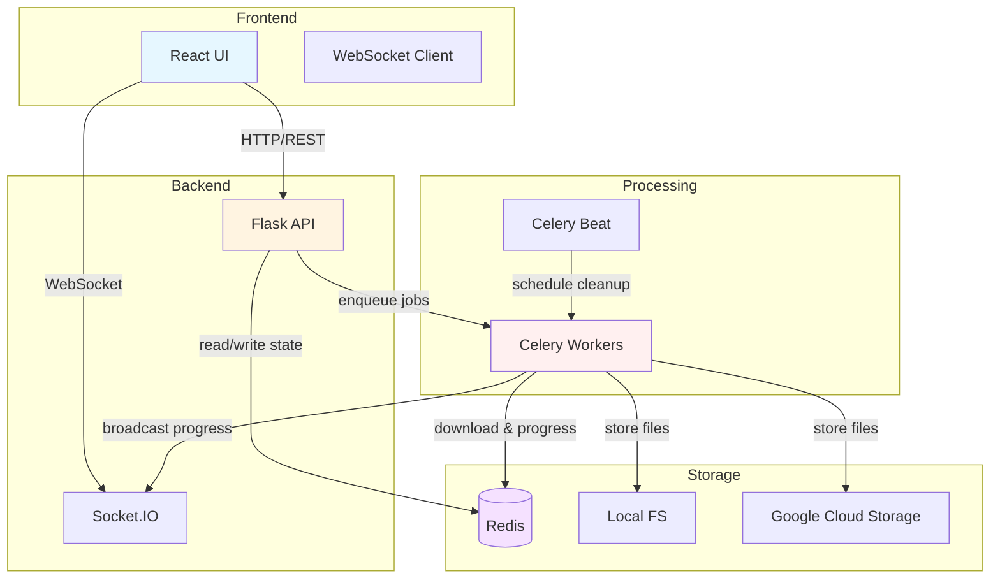
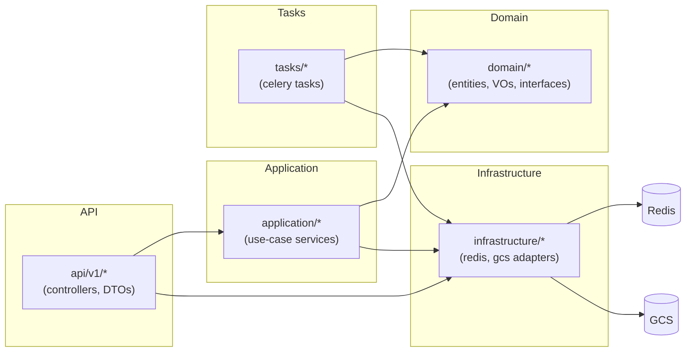

# UltraDL Backend — Architecture (diagrams)

Below are two Mermaid diagrams summarizing the backend architecture: a high-level component diagram and a layer/component mapping that shows where to find key files.

### High-level architecture

### Layer & component map

### Captions & quick notes

- Entry point: `backend/main.py` — wires infra (Redis, Celery, optional Socket.IO, GCS), constructs repos and services, and registers the API blueprint.
- Recommended improvement: introduce `create_app(config=None)` as the composition root for cleaner tests and easier wiring.
- Where to look first: `backend/main.py`, `backend/api/v1/namespaces.py`, `backend/domain/job_management/`, `backend/application/job_service.py`, `backend/tasks/download_task.py`.

If you'd like, I can produce a PNG/SVG of these diagrams or add a 1-line run command under each diagram for convenience.
