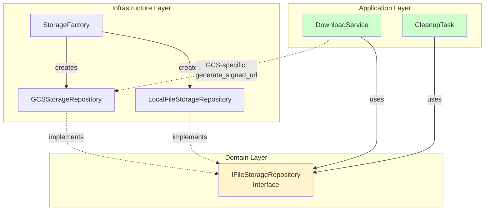

# Storage Abstraction Consolidation

## Overview

This document describes the consolidation of duplicate storage abstractions in the UltraDL backend, completed as part of the DDD Architecture Fix (Task 19).

## Problem

The codebase had duplicate storage abstractions:

1. **IFileStorageRepository** - Domain-defined interface for file storage operations
2. **StorageService** - Infrastructure wrapper that duplicated the IFileStorageRepository interface

This duplication violated DDD principles and added unnecessary complexity.

## Solution

### Changes Made

1. **Removed StorageService** (`backend/infrastructure/storage_service.py`)
   - This was a wrapper around IFileStorageRepository that provided no additional value
   - All functionality is now handled directly through IFileStorageRepository implementations

2. **Enhanced GCSStorageRepository** (`backend/infrastructure/gcs_storage_repository.py`)
   - Added `generate_signed_url()` method for GCS-specific signed URL generation
   - This method is infrastructure-specific and not part of the IFileStorageRepository interface

3. **Updated DownloadService** (`backend/application/download_service.py`)
   - Now uses IFileStorageRepository directly instead of StorageService
   - For GCS signed URLs, checks if storage_repository is GCSStorageRepository instance
   - Calls `generate_signed_url()` method directly on GCS repository when needed

4. **Updated CleanupTask** (`backend/tasks/cleanup_task.py`)
   - Removed reference to non-existent GCSRepository
   - Now uses storage_repository from DependencyContainer
   - Checks if storage_repository is GCSStorageRepository for GCS-specific cleanup

5. **Updated Infrastructure Module** (`backend/infrastructure/__init__.py`)
   - Removed StorageService from exports
   - Kept only the essential storage components

## Architecture After Consolidation



## Benefits

1. **Single Source of Truth**: IFileStorageRepository is the only storage abstraction
2. **Cleaner Architecture**: Removed unnecessary wrapper layer
3. **Better DDD Compliance**: Application layer depends on domain interfaces only
4. **Simplified Codebase**: Less code to maintain and understand
5. **Type Safety**: Direct use of interfaces improves type checking

## Migration Notes

### For Developers

- **Use IFileStorageRepository directly** instead of StorageService
- **Get storage repository from DependencyContainer**: `container.get_storage_repository()`
- **For GCS signed URLs**: Check if repository is GCSStorageRepository instance and call `generate_signed_url()`

### Example Usage

```python
# Get storage repository from container
storage_repo = container.get_storage_repository()

# Use standard IFileStorageRepository methods
storage_repo.save(file_path, content)
storage_repo.exists(file_path)
storage_repo.delete(file_path)

# For GCS-specific operations (signed URLs)
from infrastructure.gcs_storage_repository import GCSStorageRepository

if isinstance(storage_repo, GCSStorageRepository):
    signed_url = storage_repo.generate_signed_url(blob_name, ttl_minutes=10)
```

## Testing Impact

- **Unit tests for StorageService**: Need to be removed or updated
- **Integration tests**: Should continue to work with IFileStorageRepository
- **Application layer tests**: Should mock IFileStorageRepository directly

## Requirements Satisfied

This consolidation satisfies **Requirement 8.5** from the DDD Architecture Fix specification:
- Remove duplicate storage abstractions
- Consolidate to single IFileStorageRepository interface usage
- Update all references to use unified interface

## Related Tasks

- Task 8: Create storage factory for unified storage selection ✓
- Task 19: Remove duplicate storage abstractions ✓ (This task)
