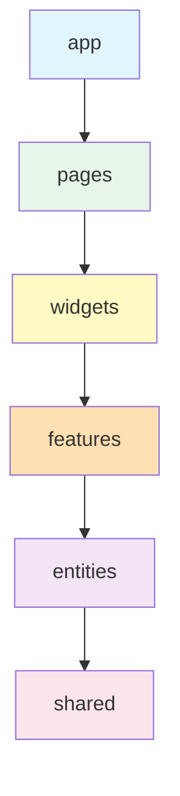

# Frontend Development Guide

**For developers contributing to the UltraDL React frontend.**

---

## 🚀 Quick Start

```bash
cd frontend
npm install
npm run dev  # Access at http://localhost:5000
```

---

## 🏗️ Architecture: Feature-Sliced Design (FSD)

### Layer Hierarchy



**Critical Rules:**
- Lower layers CANNOT import from higher layers
- Features CANNOT import from other features (use `shared/`)
- Each slice exports public API via `index.ts`
- Use `@/` alias for all imports

### Layer Responsibilities

| Layer | Purpose | Example |
|-------|---------|---------|
| `app/` | Providers, router, global config | App.tsx, main.tsx |
| `pages/` | Route compositions (no business logic) | Index.tsx, NotFound.tsx |
| `widgets/` | Self-contained UI blocks | DownloadWidget |
| `features/` | User interactions, business operations | url-validation, download-manager |
| `entities/` | Business models, API calls (no UI) | job, video |
| `shared/` | UI primitives (shadcn/ui), utilities | Button, utils.ts |

### Current Structure

```
frontend/src/
├── app/            # App providers, router
├── pages/          # Index, NotFound
├── components/     # Legacy (migrate to FSD)
│   ├── ui/         # shadcn/ui components
│   ├── UrlInput.tsx
│   ├── VideoPreview.tsx
│   ├── ResolutionPicker.tsx
│   ├── DownloadButton.tsx
│   ├── ProgressTracker.tsx
│   └── ErrorCard.tsx
├── hooks/          # Custom hooks
│   ├── useJobStatusWithWebSocket.ts
│   └── use-toast.ts
└── lib/            # Utilities
    ├── utils.ts
    └── errors.ts
```

---

## 🎯 Component Development

### Component Order

1. Imports → 2. Types → 3. Hooks → 4. Effects → 5. Handlers → 6. Render

### Patterns

```tsx
// ✅ Functional components with props destructuring
export const Component = ({ title, onAction }: Props) => {
  const [state, setState] = useState();
  const handleClick = () => onAction();
  return <Button onClick={handleClick}>{title}</Button>;
};

// ✅ Memo for expensive components
export const ExpensiveComponent = memo(({ data }: Props) => {
  return <div>{/* Heavy rendering */}</div>;
});
```

---

## 🪝 Custom Hooks

```tsx
// hooks/useMyHook.ts
export const useMyHook = (initialValue: string) => {
  const [value, setValue] = useState(initialValue);
  useEffect(() => { /* Side effect */ }, [value]);
  return { value, setValue };
};
```

---

## 🌐 API Integration

```tsx
// TanStack Query
const { data, isLoading, error } = useQuery({
  queryKey: ["resource", id],
  queryFn: async () => {
    const res = await fetch(`/api/v1/resource/${id}`);
    if (!res.ok) throw new Error("Failed");
    return res.json();
  },
});

// WebSocket
const { status, progress, error } = useJobStatusWithWebSocket(jobId);
```

---

## ✅ Testing

```bash
npm test                # Watch mode
npm run test:ui         # UI mode
npm run test:run        # CI mode
npm test -- --coverage  # Coverage
```

```tsx
import { render, fireEvent, waitFor } from "@testing-library/react";

test("button click triggers action", async () => {
  const mockFn = vi.fn();
  render(<Button onClick={mockFn}>Click</Button>);
  fireEvent.click(screen.getByText("Click"));
  await waitFor(() => expect(mockFn).toHaveBeenCalled());
});
```

---

## 🎨 Styling

```tsx
// Tailwind utility classes
<div className="flex items-center gap-4 p-6 bg-white rounded-lg shadow-md">
  <p className="text-lg font-semibold text-gray-900">Content</p>
</div>

// Conditional classes with cn()
import { cn } from "@/lib/utils";
<div className={cn("base-class", isActive && "active-class")} />

// Framer Motion animations
<motion.div
  initial={{ opacity: 0, y: 20 }}
  animate={{ opacity: 1, y: 0 }}
  transition={{ duration: 0.3 }}
>
  Content
</motion.div>
```

---

## 🔔 User Feedback

```tsx
import { toast } from "sonner";
import { parseApiError, formatErrorForToast } from "@/lib/errors";

// Toast notifications
toast.success("Download complete!");
toast.error("Failed to download");

// Error handling
try {
  await apiCall();
} catch (error) {
  const parsed = parseApiError(error);
  toast.error(formatErrorForToast(parsed));
}
```

---

## 🔐 Security

```tsx
// Input validation
const handleSubmit = (url: string) => {
  if (!isValidYouTubeUrl(url)) {
    toast.error("Invalid YouTube URL");
    return;
  }
};

// XSS Prevention: React escapes by default
<div>{userInput}</div>  // ✅ Safe

// Avoid dangerouslySetInnerHTML
<div dangerouslySetInnerHTML={{ __html: userInput }} />  // ❌ Dangerous
```

---

## 📊 Performance

```tsx
// Code splitting
import { lazy, Suspense } from "react";
const HeavyComponent = lazy(() => import("./HeavyComponent"));

<Suspense fallback={<Loading />}>
  <HeavyComponent />
</Suspense>
```

**Tips:** Use `React.memo`, debounce input, lazy load images, minimize re-renders

---

## 🔄 Build & Deploy

```bash
npm run build        # Production
npm run preview      # Preview
npm run build:dev    # Development

# .env.local (gitignored)
VITE_API_URL=http://localhost:8000
```

## 📦 Dependencies

```bash
npm install package-name      # Add
npm install -D package-name   # Add dev
npm uninstall package-name    # Remove
npm run build && du -sh dist/ # Bundle size
```

---

## 🎯 Naming Conventions

- Components: `PascalCase` (`MyComponent`)
- Hooks: `camelCase` starting with 'use' (`useMyHook`)
- Props: `camelCase` (`onClick`, `isActive`)
- Constants: `SCREAMING_SNAKE_CASE` (`API_URL`)

---

## 📚 Resources

- [PROJECT_GUIDE.md](../PROJECT_GUIDE.md) - Full architecture patterns
- [README](./README.md) - Frontend overview
- [React Documentation](https://react.dev/)
- [TanStack Query](https://tanstack.com/query/latest)
- [Tailwind CSS](https://tailwindcss.com/docs)
- [shadcn/ui](https://ui.shadcn.com/)
- [Framer Motion](https://www.framer.com/motion/)

---

**Questions?** Open an issue or reach out to the team.
