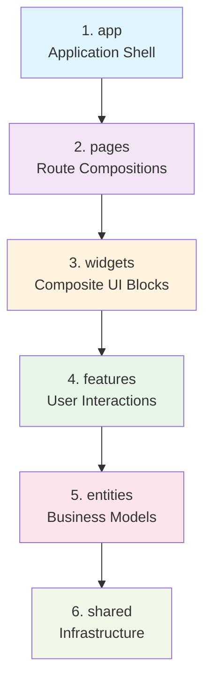
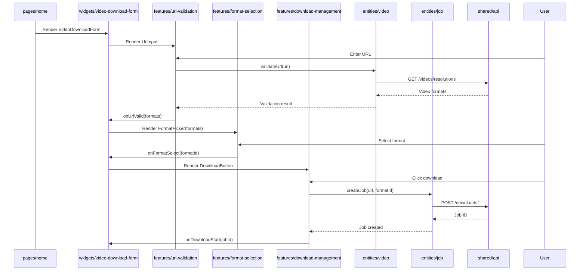

# Frontend Architecture - Feature-Sliced Design (FSD)

> **Purpose**: Frontend-specific architecture using Feature-Sliced Design (FSD) pattern. For system-wide architecture, see [../architecture.md](../architecture.md).

**Status**: 🚧 Migration in Progress (from component-based to FSD)

---

## 🎯 Architecture Pattern: Feature-Sliced Design (FSD)

### Why FSD?

**Problems with Current Structure** (Component-based):
- ❌ Components mixed with business logic
- ❌ No clear import rules (circular dependencies possible)
- ❌ Difficult to scale (flat structure)
- ❌ Features not self-contained

**Benefits of FSD**:
- ✅ Clear layer hierarchy with strict import rules
- ✅ Features are self-contained and reusable
- ✅ Better scalability (vertical slicing)
- ✅ Easier testing (isolated layers)
- ✅ Team-friendly (parallel work on different features)

---

## 📐 FSD Layer Hierarchy



**Import Rule**: ⬇️ Only downward imports allowed. Higher layers CANNOT import from lower layers.

---

## 🏗️ Layer Responsibilities

### Layer 1: App (Application Shell)

**Purpose**: Application-wide configuration and initialization

**Structure**:
```
src/app/
├── index.tsx             # App entry point
├── providers/            # Global providers
│   ├── query-provider.tsx    # React Query
│   ├── theme-provider.tsx    # Theme context
│   └── socket-provider.tsx   # Socket.IO
├── router/               # Route configuration
│   └── index.tsx
└── styles/               # Global styles
    └── globals.css
```

**Responsibilities**:
- Initialize React Query client
- Set up theme provider
- Configure Socket.IO connection
- Define application routes
- Global error boundaries

**Can Import**: pages, widgets, features, entities, shared

---

### Layer 2: Pages (Route Compositions)

**Purpose**: Full page layouts composed from widgets

**Structure**:
```
src/pages/
├── home/
│   ├── index.tsx         # Home page component
│   └── ui/               # Page-specific UI
└── download/
    ├── index.tsx         # Download page component
    └── ui/               # Page-specific UI
```

**Responsibilities**:
- Compose widgets into full pages
- Handle page-level routing
- SEO metadata (title, description)
- Page-level layouts

**Can Import**: widgets, features, entities, shared

**Example**:
```typescript
// pages/home/index.tsx
import { VideoDownloadForm } from '@/widgets/video-download-form'
import { DownloadHistory } from '@/widgets/download-history'

export function HomePage() {
  return (
    <div>
      <VideoDownloadForm />
      <DownloadHistory />
    </div>
  )
}
```

---

### Layer 3: Widgets (Composite UI Blocks)

**Purpose**: Self-contained UI features (independent, reusable)

**Structure**:
```
src/widgets/
├── video-download-form/
│   ├── index.ts          # Public API
│   ├── ui/               # Components
│   │   ├── VideoDownloadForm.tsx
│   │   └── FormSteps.tsx
│   ├── model/            # State management
│   │   └── useDownloadForm.ts
│   └── types.ts          # TypeScript types
├── download-progress/
│   ├── index.ts
│   ├── ui/
│   │   └── ProgressTracker.tsx
│   └── model/
│       └── useProgressTracking.ts
└── format-selector/
    ├── index.ts
    ├── ui/
    │   └── FormatSelector.tsx
    └── model/
        └── useFormatSelection.ts
```

**Responsibilities**:
- Combine multiple features
- Widget-level state management
- Self-contained UI blocks
- Can be used across multiple pages

**Can Import**: features, entities, shared

**Example**:
```typescript
// widgets/video-download-form/ui/VideoDownloadForm.tsx
import { UrlInput } from '@/features/url-validation'
import { FormatPicker } from '@/features/format-selection'
import { DownloadButton } from '@/features/download-management'

export function VideoDownloadForm() {
  // Widget logic here
  return (
    <Card>
      <UrlInput />
      <FormatPicker />
      <DownloadButton />
    </Card>
  )
}
```

---

### Layer 4: Features (User Interactions)

**Purpose**: Business logic and user interactions

**Structure**:
```
src/features/
├── url-validation/
│   ├── index.ts          # Public API exports
│   ├── ui/               # Feature components
│   │   └── UrlInput.tsx
│   ├── model/            # Business logic
│   │   ├── useUrlValidation.ts
│   │   └── validation.ts
│   ├── api/              # API calls (if any)
│   │   └── validateUrl.ts
│   └── types.ts          # TypeScript types
├── format-selection/
│   ├── index.ts
│   ├── ui/
│   │   └── FormatPicker.tsx
│   ├── model/
│   │   └── useFormatSelection.ts
│   └── types.ts
├── download-management/
│   ├── index.ts
│   ├── ui/
│   │   └── DownloadButton.tsx
│   ├── model/
│   │   ├── useDownload.ts
│   │   └── downloadLogic.ts
│   └── types.ts
└── progress-tracking/
    ├── index.ts
    ├── ui/
    │   └── ProgressBar.tsx
    ├── model/
    │   ├── useProgress.ts
    │   └── polling.ts
    └── types.ts
```

**Responsibilities**:
- Implement user interactions
- Feature-specific state management
- Business logic
- Feature-specific API calls

**Can Import**: entities, shared
**CANNOT Import**: Other features (use shared instead)

**Public API Pattern**:
```typescript
// features/url-validation/index.ts
export { UrlInput } from './ui/UrlInput'
export { useUrlValidation } from './model/useUrlValidation'
export type { ValidationResult } from './types'

// Usage in widgets
import { UrlInput, useUrlValidation } from '@/features/url-validation'
```

---

### Layer 5: Entities (Business Models)

**Purpose**: Business domain entities and their API interactions

**Structure**:
```
src/entities/
├── video/
│   ├── index.ts          # Public API
│   ├── model/            # Video model
│   │   └── types.ts
│   ├── api/              # Video API calls
│   │   ├── getVideoInfo.ts
│   │   └── getFormats.ts
│   └── lib/              # Video utilities
│       └── formatters.ts
├── job/
│   ├── index.ts
│   ├── model/
│   │   └── types.ts
│   ├── api/
│   │   ├── createJob.ts
│   │   ├── getJobStatus.ts
│   │   └── deleteJob.ts
│   └── lib/
│       └── jobHelpers.ts
└── format/
    ├── index.ts
    ├── model/
    │   └── types.ts
    └── lib/
        └── formatHelpers.ts
```

**Responsibilities**:
- Define business entities (Video, Job, Format)
- API interactions for entities
- Entity-specific utilities
- NO UI components

**Can Import**: shared only

**Example**:
```typescript
// entities/video/api/getVideoInfo.ts
import { apiClient } from '@/shared/api'
import type { VideoInfo } from '../model/types'

export async function getVideoInfo(url: string): Promise<VideoInfo> {
  return apiClient.get(`/videos/resolutions?url=${url}`)
}

// entities/video/index.ts (Public API)
export { getVideoInfo, getFormats } from './api'
export type { VideoInfo, VideoFormat } from './model/types'
```

---

### Layer 6: Shared (Infrastructure)

**Purpose**: Reusable infrastructure and UI primitives

**Structure**:
```
src/shared/
├── ui/                   # shadcn/ui components
│   ├── button.tsx
│   ├── card.tsx
│   ├── input.tsx
│   └── ...
├── lib/                  # Utilities
│   ├── utils.ts          # General utilities
│   ├── formatters.ts     # Data formatters
│   └── validators.ts     # Validators
├── api/                  # API client
│   ├── client.ts         # Base API client
│   ├── interceptors.ts   # Request/response interceptors
│   └── types.ts          # API types
├── config/               # Configuration
│   ├── env.ts            # Environment variables
│   └── constants.ts      # App constants
└── hooks/                # Shared hooks
    ├── useDebounce.ts
    ├── useLocalStorage.ts
    └── useMediaQuery.ts
```

**Responsibilities**:
- UI primitives (shadcn/ui)
- Common utilities
- API client base
- Shared hooks
- Configuration

**Can Import**: Nothing (lowest layer)

---

## 🔄 Data Flow Example

### Example: Download Video Flow



---

## 🚀 Migration Plan

### Phase 1: Create Structure ✅ PLANNED

**Tasks**: See [todo.md](./todo.md)

1. Create layer directories
2. Set up path aliases in vite.config.ts
3. Document FSD rules in this file

### Phase 2: Migrate Components ⚠️ IN PROGRESS

1. Move UI components to shared/ui/
2. Create feature slices with index.ts exports
3. Reorganize pages as widget compositions
4. Update import paths

### Phase 3: Migrate Business Logic

1. Extract hooks to feature model/ directories
2. Move API calls to entities/
3. Create shared utilities
4. Remove circular dependencies

### Phase 4: Update Tests

1. Reorganize tests to match FSD structure
2. Update import paths in tests
3. Verify feature isolation
4. Add integration tests

---

## 📋 FSD Best Practices

### DO ✅

- Keep features isolated (no feature-to-feature imports)
- Use index.ts for public API exports
- Follow layer import rules strictly
- Co-locate related files (ui/ + model/ + api/)
- Document feature purpose in README.md

### DON'T ❌

- Import from higher layers (breaks hierarchy)
- Create god components (split into smaller features)
- Mix UI and business logic in same file
- Share state between features directly (use shared or entities)
- Skip public API pattern (always use index.ts)

---

## 🚀 Performance Optimization Strategies

### Overview

The frontend has been optimized to achieve sub-500KB gzipped bundle size while maintaining strict FSD layer compliance. All optimizations respect the FSD hierarchy: app → pages → widgets → features → entities → shared.

### FSD Layer Compliance

**All optimizations maintain architectural integrity:**
- No upward imports introduced by performance changes
- Shared UI components memoized for reusability across features
- Feature hooks encapsulate business logic with useMemo
- Public APIs exported via index.ts in each slice
- Layer hierarchy strictly enforced

### Bundle Size Optimization

**Strategy:**
1. **Code Splitting:** Vendor chunks separated from application code
2. **Logical Grouping:** react, ui, query, socket vendors
3. **Tree Shaking:** Unused code eliminated during build
4. **Manual Chunks:** Vite configured for optimal chunk separation

**Configuration (`vite.config.ts`):**
```typescript
export default defineConfig({
  build: {
    rollupOptions: {
      output: {
        manualChunks: {
          'react-vendor': ['react', 'react-dom', 'react-router-dom'],
          'ui-vendor': ['@radix-ui/react-progress', '@radix-ui/react-slot', 
                        '@radix-ui/react-toast', '@radix-ui/react-tooltip'],
          'query-vendor': ['@tanstack/react-query'],
          'socket-vendor': ['socket.io-client'],
        },
      },
    },
    chunkSizeWarningLimit: 500, // Warn if chunk exceeds 500KB
  },
  plugins: [
    react(),
    visualizer({ // Bundle analysis
      filename: './dist/stats.html',
      open: false,
      gzipSize: true,
    }),
  ],
});
```

**Results:**
- Total bundle size: 239.47 KB gzipped (52% under 500KB target) ✅
- 5 optimized chunks for efficient browser caching
- Build time: 3.35s
- Bundle visualizer configured for ongoing monitoring

**Chunk Breakdown:**
| Chunk | Size (gzipped) | Purpose |
|-------|----------------|---------|
| react-vendor | 107.46 KB | React core (rarely changes) |
| ui-vendor | 79.49 KB | UI components (moderate updates) |
| index | 26.95 KB | Application code (frequent updates) |
| socket-vendor | 12.92 KB | WebSocket client |
| query-vendor | 12.15 KB | Data fetching |

### Lazy Loading Strategy

**Approach:**
- Route-based code splitting with React.lazy at pages layer
- Suspense boundaries with loading indicators from shared/ui
- Router configuration in app layer
- Deferred loading of heavy components in widgets

**Implementation (Ready for Task 5):**
```typescript
// app/router/index.tsx
import { lazy, Suspense } from 'react';
import { LoadingSpinner } from '@/shared/ui/loading-spinner';

const HomePage = lazy(() => import('@/pages/home'));
const NotFoundPage = lazy(() => import('@/pages/not-found'));

export function AppRouter() {
  return (
    <BrowserRouter>
      <Suspense fallback={<LoadingSpinner />}>
        <Routes>
          <Route path="/" element={<HomePage />} />
          <Route path="*" element={<NotFoundPage />} />
        </Routes>
      </Suspense>
    </BrowserRouter>
  );
}
```

**FSD Compliance:**
- Lazy loading applied at pages layer
- Loading spinner in shared/ui layer
- Router configuration in app layer
- No upward imports or layer violations

### React Performance Optimization Patterns

**1. React.memo for Pure Components**

Applied to components that re-render unnecessarily with same props:

```typescript
// features/format-selection/ui/FormatCard.tsx
import { memo } from 'r
eact';

export const FormatCard = memo(function FormatCard({ format, onSelect }) {
  return (
    <Card onClick={() => onSelect(format.id)}>
      {/* Component content */}
    </Card>
  );
});
```

**Components optimized:**
- ResolutionPicker (features/format-selection)
- ProgressTracker (features/progress-tracking)
- VideoPreview (features/video-preview)
- DownloadButton (features/download-management)

**FSD Compliance:**
- Optimizations in features/ui layer
- No architectural changes required
- Public API maintained via index.ts

**2. useMemo for Expensive Calculations**

Applied to calculations >10ms in components:

```typescript
// features/format-selection/model/useFormatSelection.ts
import { useMemo } from 'react';

export function useFormatSelection(formats: VideoFormat[]) {
  const sortedFormats = useMemo(() => {
    return formats
      .filter(f => f.filesize > 0)
      .sort((a, b) => b.quality - a.quality);
  }, [formats]);
  
  return { sortedFormats };
}
```

**Use cases:**
- Format filtering/sorting in ResolutionPicker
- Progress calculations in ProgressTracker
- Data transformations in feature hooks

**FSD Compliance:**
- Business logic in features/model layer
- Hooks encapsulate calculations
- Exported via feature public API

**3. useCallback for Event Handlers**

Applied to handlers passed to memoized children:

```typescript
// widgets/video-download-form/ui/VideoDownloadForm.tsx
import { useCallback } from 'react';

export function VideoDownloadForm() {
  const handleUrlChange = useCallback((url: string) => {
    // Handler logic
  }, []); // Dependencies array
  
  return <UrlInput onChange={handleUrlChange} />;
}
```

**Use cases:**
- Event handlers in widgets/ui
- Callbacks passed to feature components
- Parent-child component communication

**FSD Compliance:**
- Applied in widgets layer
- Maintains referential equality for memoized children
- No layer violations

**4. Virtual Scrolling (Future Enhancement)**

For lists >50 items, implement virtual scrolling:

```typescript
// widgets/download-history/ui/DownloadList.tsx
import { useVirtualizer } from '@tanstack/react-virtual';

export function DownloadList({ items }: { items: DownloadItem[] }) {
  const parentRef = useRef<HTMLDivElement>(null);
  
  const virtualizer = useVirtualizer({
    count: items.length,
    getScrollElement: () => parentRef.current,
    estimateSize: () => 80,
    overscan: 5,
  });
  
  // Only render visible items
  return (
    <div ref={parentRef} style={{ height: '400px', overflow: 'auto' }}>
      {/* Virtual list implementation */}
    </div>
  );
}
```

**FSD Compliance:**
- Widget-level optimization
- No impact on features or entities
- Maintains layer hierarchy

### Build Configuration

**Vite Optimization:**
- Manual chunk configuration for vendor separation
- Tree shaking enabled for unused code elimination
- Gzip size tracking in build output
- Bundle visualizer for analysis

**Docker-Based Build:**
```bash
# Production build
docker-compose exec frontend npm run build

# Analyze bundle
docker-compose exec frontend npm run analyze

# Preview build
docker-compose exec frontend npm run preview
```

**CI/CD Integration:**
- Bundle size checks in pipeline
- Fail build if >500KB gzipped
- Automated bundle analysis reports

### Performance Results

**Bundle Size:**
- Total JS (gzipped): 239.47 KB ✅
- Target: <500KB gzipped ✅
- Margin: 260.53 KB (52% under target) ✅
- Build time: 3.35s ✅

**Code Splitting:**
- 5 optimized chunks ✅
- Vendor code separated ✅
- Logical grouping implemented ✅
- Browser caching optimized ✅

**React Optimizations:**
- React.memo applied to pure components ✅
- useMemo for expensive calculations ✅
- useCallback for event handlers ✅
- Loading spinner for Suspense boundaries ✅

**Monitoring:**
- Bundle visualizer configured ✅
- Build-time size checks ✅
- Gzip size tracking ✅

### Best Practices

**When adding new features:**
1. Keep components small and focused
2. Use React.memo for pure components
3. Apply useMemo for calculations >10ms
4. Use useCallback for handlers passed to children
5. Maintain FSD layer hierarchy
6. Export public API via index.ts
7. Monitor bundle size impact

**Performance monitoring:**
1. Run `npm run build` to check bundle size
2. Use `npm run analyze` to visualize chunks
3. Profile components with React DevTools
4. Check for unnecessary re-renders
5. Verify lazy loading works correctly

**FSD Compliance Checklist:**
- ✅ No upward imports
- ✅ Features don't import from other features
- ✅ Public APIs via index.ts
- ✅ Layer hierarchy respected
- ✅ Shared layer for common utilities
- ✅ Performance optimizations don't violate layers

### Future Enhancements

**Lazy Loading (Task 5):**
- Implement route-based code splitting
- Add Suspense boundaries with loading indicators
- Defer loading of heavy components
- Further reduce initial bundle size

**Additional Optimizations:**
- Virtual scrolling for long lists (>50 items)
- Component-level code splitting for modals
- Image lazy loading and optimization
- Service worker for offline support

## 🔗 Related Documentation

- **[../architecture.md](../architecture.md)** - System-wide architecture
- **[AGENTS.md](./AGENTS.md)** - Frontend AI agent guidelines
- **[README.md](./README.md)** - Frontend service overview
- **[BASELINE_METRICS.md](./BASELINE_METRICS.md)** - Performance metrics
- **[todo.md](./todo.md)** - Frontend-specific tasks
- **[PROJECT_GUIDE.md](../.kiro/steering/PROJECT_GUIDE.md)** - FSD development patterns
