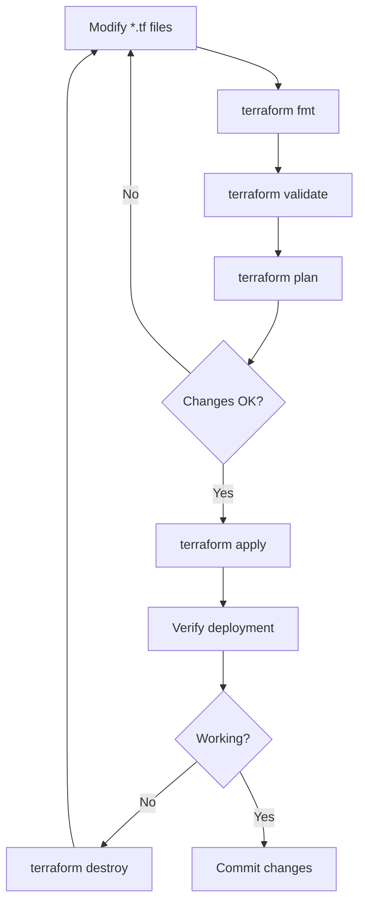

# Infrastructure Operations Guide

**For DevOps engineers managing UltraDL infrastructure.**

## Quick Start

**Prerequisites:** Terraform 1.0+, gcloud CLI, GCP account with billing, Docker

**Initial Setup:**
```bash
cd iac
terraform init
cp terraform.tfvars.example terraform.tfvars
vim terraform.tfvars  # Edit with your values
```

**Structure:**
```
iac/
├── main.tf          # Main Terraform config
├── variables.tf     # Input variables
├── outputs.tf       # Output values
├── startup.sh       # VM initialization script
└── Makefile         # Helper commands
```

## Module Development Workflow



## Common Operations

**Deploy/Update:**
```bash
terraform plan              # Review changes
terraform apply             # Apply changes
terraform apply -auto-approve  # CI/CD mode
```

**Destroy:**
```bash
terraform destroy           # All resources
terraform destroy -target=google_compute_instance.vm  # Specific resource
```

**Makefile shortcuts:**
```bash
make init validate fmt plan apply destroy
```

## VM Management

**Access VM:**
```bash
gcloud compute ssh ultradl-vm --zone=us-central1-a
```

**Check services:**
```bash
docker ps
docker logs ultradl_backend
docker logs ultradl_celery-worker
```

**Update application:**
```bash
cd /opt/ultra-dl
git pull origin main
docker-compose -f docker-compose.prod.yml up -d --build
```

**Rollback:**
```bash
git reset --hard <commit-hash>
docker-compose -f docker-compose.prod.yml up -d --build
```

## Monitoring & Health Checks

**API health:**
```bash
curl https://your-domain.com/health
```

**Service checks:**
```bash
docker exec ultradl_redis redis-cli ping
docker exec ultradl_celery-worker celery -A celery_app inspect active
```

**VM diagnostics:**
```bash
gcloud compute instances describe ultradl-vm --zone=us-central1-a
gcloud compute instances get-serial-port-output ultradl-vm --zone=us-central1-a
```

## Security Operations

**Rotate GCS credentials:**
```bash
gcloud iam service-accounts keys create new-key.json \
  --iam-account=ultradl-storage@PROJECT_ID.iam.gserviceaccount.com
scp new-key.json ultradl-vm:/opt/ultra-dl/gcs-credentials.json
docker-compose restart backend celery-worker
```

**Update secrets:**
```bash
vim /opt/ultra-dl/.env.prod
docker-compose -f docker-compose.prod.yml restart
```

## Scaling

**Vertical (bigger VM):**
```terraform
# terraform.tfvars
machine_type = "e2-standard-2"  # From e2-medium
```

**Horizontal (more workers):**
```bash
# .env.prod
CELERY_WORKER_CONCURRENCY=8  # From 4
docker-compose restart celery-worker
```

## Troubleshooting

**GCS access issues:**
```bash
gcloud projects get-iam-policy PROJECT_ID \
  --flatten="bindings[].members" \
  --filter="bindings.members:serviceAccount:ultradl-storage*"
gsutil ls gs://your-bucket-name
```

**High costs:**
```bash
gsutil du -sh gs://your-bucket-name
gsutil lifecycle get gs://your-bucket-name
gcloud compute instances list
```

## Cost Optimization

**Storage lifecycle (auto-delete after 1 day):**
```bash
cat > lifecycle.json << EOF
{
  "lifecycle": {
    "rule": [{
      "action": {"type": "Delete"},
      "condition": {"age": 1}
    }]
  }
}
EOF
gsutil lifecycle set lifecycle.json gs://your-bucket-name
```

**Preemptible VMs (dev only):**
```terraform
scheduling {
  preemptible = true
  automatic_restart = false
}
```

## CI/CD Integration

**GitHub Actions:**
```yaml
name: Deploy
on:
  push:
    branches: [main]
jobs:
  deploy:
    runs-on: ubuntu-latest
    steps:
      - uses: actions/checkout@v2
      - uses: hashicorp/setup-terraform@v1
      - run: |
          cd iac
          terraform init
          terraform apply -auto-approve
```

## Backup & Recovery

**GCS backup:**
```bash
gsutil mb gs://ultradl-backup
gsutil -m cp -r gs://ultradl-downloads gs://ultradl-backup/
```

**VM snapshot:**
```bash
gcloud compute disks snapshot ultradl-vm \
  --snapshot-names=ultradl-backup-$(date +%Y%m%d) \
  --zone=us-central1-a
```

## Best Practices

1. **Always run `terraform plan` before `apply`** - Review changes to avoid surprises
2. **Use remote state** - Store state in GCS for team collaboration
3. **Version lock** - Pin Terraform and provider versions in configuration
4. **Validate inputs** - Add validation rules to all variables
5. **Tag resources** - Use consistent labels for cost tracking
6. **Test in dev** - Use preemptible VMs for development/testing
7. **Monitor costs** - Set up billing alerts and review monthly
8. **Backup state** - Enable versioning on state bucket
9. **Document changes** - Update README.md when modifying infrastructure
10. **Use modules** - Create reusable modules for common patterns

## Testing Procedures

**Pre-deployment validation:**
```bash
terraform fmt -check      # Verify formatting
terraform validate        # Check syntax
terraform plan           # Review changes
```

**Post-deployment verification:**
```bash
# Check VM is running
gcloud compute instances list

# Verify services
curl https://your-domain.com/health

# Check logs
docker logs ultradl_backend --tail 50
```

**Rollback procedure:**
1. Identify last working state: `terraform state list`
2. Revert configuration changes
3. Run `terraform plan` to verify rollback
4. Apply: `terraform apply`
5. Verify services are healthy

## Resources

- [README](./README.md) - Deployment guide
- [ARCHITECTURE](./ARCHITECTURE.md) - Infrastructure design
- [Terraform Docs](https://www.terraform.io/docs)
- [GCP Docs](https://cloud.google.com/docs)
