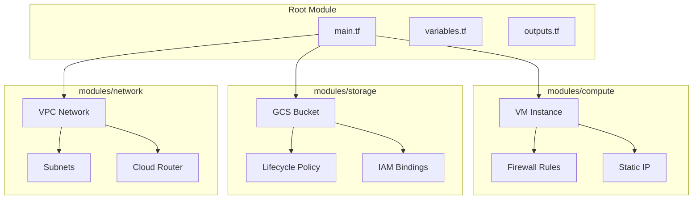
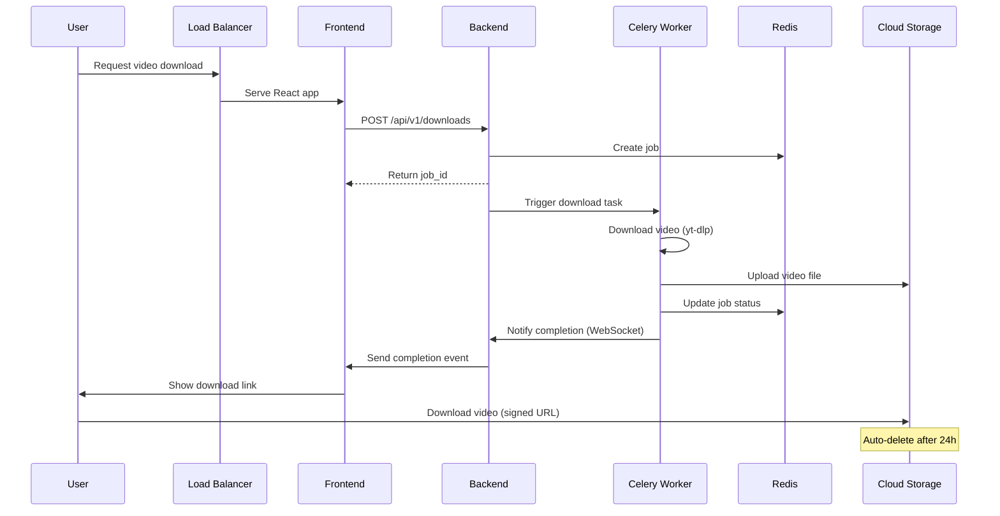

# Infrastructure Architecture

**UltraDL GCP Infrastructure Design**

---

## Architecture Overview

```mermaid
graph TB
    subgraph "Internet"
        Users[Users]
        DNS[Cloud DNS]
    end

    subgraph "GCP - us-central1"
        LB[Cloud Load Balancer]

        subgraph "Compute Engine"
            VM[VM Instance<br/>e2-medium<br/>30GB Disk]

            subgraph "Docker Containers"
                Traefik[Traefik<br/>Reverse Proxy]
                Frontend[Frontend<br/>React + Nginx]
                Backend[Backend<br/>Flask API]
                Worker[Celery Worker<br/>Video Processing]
                Beat[Celery Beat<br/>Cleanup Jobs]
                Redis[Redis<br/>Job Queue]
            end
        end

        subgraph "Cloud Storage"
            GCS[GCS Bucket<br/>Video Files<br/>1-day TTL]
        end

        subgraph "Monitoring"
            Logging[Cloud Logging]
            Monitoring[Cloud Monitoring]
        end
    end

    Users --> DNS
    DNS --> LB
    LB --> VM
    VM --> Traefik
    Traefik --> Frontend
    Traefik --> Backend
    Backend --> Worker
    Worker --> GCS
    Worker --> Redis
    Backend --> Redis
    Beat --> Redis

    VM -.-> Logging
    VM -.-> Monitoring
    GCS -.-> Logging
```

---

## Terraform Module Composition



---

## Infrastructure Components

### Compute Resources

**VM Instance:**
- Machine Type: `e2-medium` (2 vCPUs, 4GB RAM)
- Disk: 30GB SSD persistent disk
- OS: Ubuntu 22.04 LTS
- Region: us-central1, Zone: us-central1-a
- External IP: Static (reserved)
- Firewall: HTTP (80), HTTPS (443), SSH (22)

### Storage

**Cloud Storage Bucket:**
- Storage Class: Standard
- Location: US (multi-region)
- Lifecycle: Auto-delete after 1 day
- Access: Service account with `objectAdmin` role

### Container Architecture

```mermaid
graph LR
    subgraph "Entry Point"
        Traefik[Traefik<br/>:80]
    end

    subgraph "Frontend"
        Frontend[React App<br/>Nginx]
    end

    subgraph "Backend Services"
        Backend[Flask API<br/>:8000]
        Worker[Celery Worker]
        Beat[Celery Beat]
    end

    subgraph "Data Layer"
        Redis[(Redis<br/>:6379)]
    end

    Traefik -->|/| Frontend
    Traefik -->|/api| Backend
    Backend --> Redis
    Worker --> Redis
    Beat --> Worker
```

---

## Data Flow

### Download Workflow



---

## Security Architecture

**Security Layers:**
1. **Firewall:** Only HTTP/HTTPS/SSH allowed
2. **Traefik:** Reverse proxy with rate limiting
3. **IAM:** Service account with minimal permissions (storage.objectAdmin)
4. **GCS:** Private bucket, signed URLs only
5. **Redis:** Password-protected in production

---

## Scaling Strategy

**Vertical:** e2-medium → e2-standard-2/4/8 (update `machine_type` variable)  
**Horizontal:** Multi-VM with Cloud Memorystore Redis and shared GCS

---

## Cost Structure

### Monthly Cost Estimate

| Resource | Configuration | Cost/Month |
|----------|--------------|------------|
| VM Instance | e2-medium | ~$25 |
| Disk | 30GB SSD | ~$5 |
| External IP | Static | ~$3 |
| Cloud Storage | 100GB avg | ~$2 |
| Egress | 500GB | ~$40 |
| **Total** | | **~$75** |

### Cost Optimization

- Use Committed Use Discounts (37% savings)
- Lifecycle policies for auto-deletion
- Preemptible VMs for dev environments (80% savings)
- Regional buckets with nearline storage for archives

---

## Disaster Recovery

**RTO:** < 1 hour | **RPO:** < 24 hours

**Backups:** Daily disk snapshots, weekly GCS bucket backups

---

## Monitoring & Alerts

**Infrastructure:** CPU > 80%, Memory > 85%, Disk > 90%  
**Application:** API latency > 500ms (p95), Task failure > 10%, Queue > 100  
**Storage:** GCS size growth, egress cost monitoring

---

## Module Structure

### Compute Module (`modules/compute`)
**Resources:** VM instance, static IP, firewall rules  
**Variables:** `machine_type`, `zone`, `disk_size_gb`, `firewall_ports`  
**Outputs:** `instance_id`, `external_ip`, `internal_ip`

### Storage Module (`modules/storage`)
**Resources:** GCS bucket, lifecycle rules, IAM bindings  
**Variables:** `bucket_name`, `location`, `lifecycle_age_days`  
**Outputs:** `bucket_name`, `bucket_url`

### Network Module (`modules/network`)
**Resources:** VPC, subnets, cloud router  
**Variables:** `network_name`, `subnet_cidr`, `region`  
**Outputs:** `network_id`, `subnet_id`

---

## Best Practices

**Module Development:**
- Add variable validation blocks
- Include output descriptions
- Maintain per-module README.md
- Use semantic versioning
- Validate with `terraform validate` and `terraform plan`

**Resource Naming:** `{project}-{resource}-{env}` (e.g., `ultradl-vm-prod`)  
**Labels:** `environment`, `project`, `managed-by`

**State Management:**
- Remote state in GCS bucket with locking
- Separate state per environment
- Never commit state files to git

---

## Maintenance

**Weekly:** Review logs, check storage, verify backups  
**Monthly:** Update OS, rotate credentials, review costs, clean snapshots

**Update Checklist:** Backup → Test → Schedule → Apply → Verify → Monitor → Rollback ready

---

## Resources

- [README](./README.md) - Deployment guide
- [AGENTS](./AGENTS.md) - Operations guide
- [Terraform Docs](https://registry.terraform.io/providers/hashicorp/google/latest/docs)

---

**Version:** 1.0 | **Updated:** November 11, 2025
